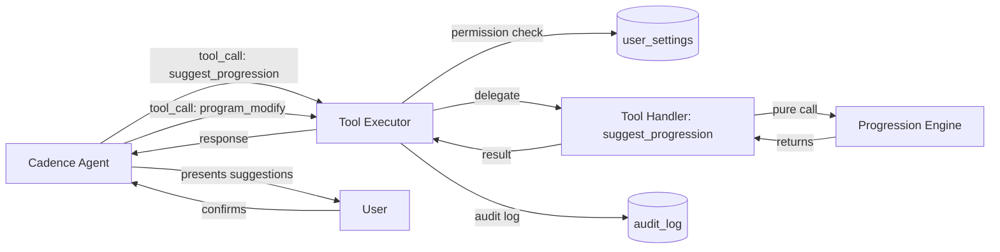

# Design Document: Adaptive Programming

## Overview

The Adaptive Programming feature introduces a heuristic-based progression engine that analyzes session history, recovery data, and program targets to produce structured exercise-level suggestions. It is implemented as a pure function (`progression-engine.ts`) in the Supabase Edge Functions shared directory, invoked by a new `suggest_progression` tool handler that slots into the existing Cadence Agent tool-call framework.

### Key Design Decisions

1. **Pure function progression engine**: All progression logic lives in a single exported pure function with no database or network dependencies. This enables full deterministic unit and property-based testing.
2. **Tool handler delegates to engine**: The `suggest_progression` tool handler in `tool-handlers.ts` simply forwards its arguments to the progression engine and returns the result. No business logic lives in the handler.
3. **No DB schema changes**: The engine receives all data as pre-assembled arguments from the agent (which fetches via existing tools). The `primary_muscle_group` field already exists on the `exercises` table.
4. **Rule priority for conflict resolution**: When multiple rules apply to one exercise, the engine picks the single highest-priority rule: `rest_day > deload > reduce_weight > reduce_volume > increase_weight > maintain`.
5. **Muscle group classification**: Uses `primary_muscle_group` from the exercises table. Upper body = chest, back, shoulders, biceps, triceps. Lower body = quads, hamstrings, glutes, calves.
6. **Rep range parsing**: The target rep range string `"8-12"` is parsed into `{ lower: 8, upper: 12 }`.
7. **Weight rounding**: All weight calculations are rounded to the nearest 0.5 kg using `Math.round(value * 2) / 2`.

## Architecture



The agent is responsible for:
1. Calling `get_session_details`, `get_recovery_summary`, and `get_active_program` to gather raw data.
2. Assembling the data into the `suggest_progression` input shape.
3. Calling `suggest_progression` with the assembled data.
4. Presenting results conversationally and requesting user confirmation.
5. Calling `program_modify` only after user approval.

## Components and Interfaces

### Progression Engine Module

**File**: `supabase/functions/_shared/progression-engine.ts`

```typescript
// --- Input Types ---

export type MuscleGroup =
  | 'chest' | 'back' | 'shoulders' | 'biceps' | 'triceps'   // upper body
  | 'quads' | 'hamstrings' | 'glutes' | 'calves';           // lower body

export type SuggestionType =
  | 'rest_day'
  | 'deload'
  | 'reduce_weight'
  | 'reduce_volume'
  | 'increase_weight'
  | 'maintain';

export type Confidence = 'high' | 'medium';

export type Scope = 'full_program' | 'single_exercise';

export interface SetData {
  weight: number;
  reps: number;
  rpe: number | null;
}

export interface SessionEntry {
  session_date: string; // ISO date
  sets: SetData[];
}

export interface ExerciseHistory {
  exercise_name: string;
  muscle_group: MuscleGroup;
  sessions: SessionEntry[]; // ordered most-recent-first
}

export interface RecoverySummary {
  avg_sleep_hours: number;
  hrv_ms: number;
  hrv_baseline_ms: number;
  resting_hr_bpm: number;
}

export interface ProgramTarget {
  exercise_name: string;
  target_sets: number;
  target_rep_range: string; // e.g. "8-12"
  target_weight: number;
  target_rpe: number | null;
}

export interface ProgressionInput {
  exercise_history: ExerciseHistory[];
  recovery_summary: RecoverySummary;
  program_targets: ProgramTarget[];
  scope: Scope;
}

// --- Output Types ---

export interface ExerciseValues {
  weight: number;
  sets: number;
}

export interface Suggestion {
  exercise_name: string;
  suggestion_type: SuggestionType;
  current_values: ExerciseValues;
  suggested_values: ExerciseValues;
  confidence: Confidence;
  reasoning: string;
}

// --- Main Export ---

export function evaluateProgression(input: ProgressionInput): Suggestion[];
```

### Helper Functions (internal to module)

```typescript
/** Rounds a number to the nearest 0.5 */
export function roundToHalf(value: number): number {
  return Math.round(value * 2) / 2;
}

/** Parses "8-12" → { lower: 8, upper: 12 } */
export function parseRepRange(range: string): { lower: number; upper: number } {
  const [lower, upper] = range.split('-').map(Number);
  return { lower, upper };
}

/** Classifies a muscle group as upper or lower body */
export function isUpperBody(muscleGroup: MuscleGroup): boolean {
  return ['chest', 'back', 'shoulders', 'biceps', 'triceps'].includes(muscleGroup);
}

/** Determines weight increment based on muscle group classification */
export function getWeightIncrement(muscleGroup: MuscleGroup): number {
  return isUpperBody(muscleGroup) ? 2.5 : 5.0;
}
```

### Rule Evaluation Pipeline

The engine evaluates rules in the following order per exercise. The first rule that triggers wins (priority order):

```typescript
const RULE_PRIORITY: SuggestionType[] = [
  'rest_day',
  'deload',
  'reduce_weight',
  'reduce_volume',
  'increase_weight',
  'maintain',
];
```

#### Rule 1: Recovery Concern (rest_day)

```typescript
function evaluateRecoveryConcern(
  recovery: RecoverySummary
): { triggered: boolean; confidence: Confidence } {
  const sleepBreach = recovery.avg_sleep_hours < 6;
  const hrvDrop = (recovery.hrv_baseline_ms - recovery.hrv_ms) / recovery.hrv_baseline_ms;
  const hrvBreach = hrvDrop >= 0.20;

  if (!sleepBreach && !hrvBreach) return { triggered: false, confidence: 'medium' };

  return {
    triggered: true,
    confidence: sleepBreach && hrvBreach ? 'high' : 'medium',
  };
}
```

When triggered, this rule overrides all other rules for all exercises in scope.

#### Rule 2: Deload

```typescript
function evaluateDeload(
  latestSession: SessionEntry
): { triggered: boolean } {
  const setsWithRpe = latestSession.sets.filter(s => s.rpe !== null);
  if (setsWithRpe.length === 0) return { triggered: false };

  const highRpeSets = setsWithRpe.filter(s => s.rpe! > 9);
  return { triggered: highRpeSets.length > setsWithRpe.length / 2 };
}
```

Deload suggestions always have `confidence: 'high'`.

#### Rule 3: Reduce Weight

```typescript
function evaluateReduceWeight(
  sessions: SessionEntry[],
  targetRepRange: { lower: number; upper: number }
): { triggered: boolean; streak: number } {
  let streak = 0;
  for (const session of sessions) {
    const avgReps = session.sets.reduce((sum, s) => sum + s.reps, 0) / session.sets.length;
    if (avgReps < targetRepRange.lower) {
      streak++;
    } else {
      break;
    }
  }
  return { triggered: streak >= 2, streak };
}
```

#### Rule 4: Reduce Volume

```typescript
function evaluateReduceVolume(
  exerciseHistory: ExerciseHistory[],
  programTargets: ProgramTarget[]
): Map<MuscleGroup, number> {
  // Calculate total weekly sets per muscle group from program_targets
  const weeklySetsByMuscle = new Map<MuscleGroup, number>();
  for (const target of programTargets) {
    const exercise = exerciseHistory.find(e => e.exercise_name === target.exercise_name);
    if (!exercise) continue;
    const current = weeklySetsByMuscle.get(exercise.muscle_group) ?? 0;
    weeklySetsByMuscle.set(exercise.muscle_group, current + target.target_sets);
  }
  return weeklySetsByMuscle;
}
```

#### Rule 5: Increase Weight

```typescript
function evaluateIncreaseWeight(
  sessions: SessionEntry[]
): { triggered: boolean; streak: number } {
  let streak = 0;
  for (const session of sessions) {
    const setsWithRpe = session.sets.filter(s => s.rpe !== null);
    if (setsWithRpe.length === 0) break;
    const allBelowSeven = setsWithRpe.every(s => s.rpe! < 7);
    if (allBelowSeven) {
      streak++;
    } else {
      break;
    }
  }
  return { triggered: streak >= 2, streak };
}
```

#### Rule 6: Maintain (default)

Always produces a suggestion when no other rule triggers.

### Main Evaluation Flow

```typescript
export function evaluateProgression(input: ProgressionInput): Suggestion[] {
  const { exercise_history, recovery_summary, program_targets, scope } = input;

  // Determine which exercises to evaluate
  const exercises = scope === 'single_exercise'
    ? exercise_history.slice(0, 1)
    : exercise_history;

  // Check recovery concern first (global override)
  const recoveryConcern = evaluateRecoveryConcern(recovery_summary);
  if (recoveryConcern.triggered) {
    return exercises.map(ex => {
      const target = program_targets.find(t => t.exercise_name === ex.exercise_name);
      const currentWeight = target?.target_weight ?? ex.sessions[0]?.sets[0]?.weight ?? 0;
      const currentSets = target?.target_sets ?? ex.sessions[0]?.sets.length ?? 0;
      return {
        exercise_name: ex.exercise_name,
        suggestion_type: 'rest_day' as SuggestionType,
        current_values: { weight: currentWeight, sets: currentSets },
        suggested_values: { weight: currentWeight, sets: currentSets },
        confidence: recoveryConcern.confidence,
        reasoning: 'Recovery data indicates fatigue. Consider a lighter session or rest day.',
      };
    });
  }

  // Calculate volume map for reduce_volume checks
  const weeklySetsByMuscle = evaluateReduceVolume(exercise_history, program_targets);

  // Evaluate each exercise individually
  return exercises.map(ex => {
    const target = program_targets.find(t => t.exercise_name === ex.exercise_name);
    const currentWeight = target?.target_weight ?? 0;
    const currentSets = target?.target_sets ?? 0;
    const repRange = parseRepRange(target?.target_rep_range ?? '8-12');

    // Check deload
    if (ex.sessions.length > 0) {
      const deload = evaluateDeload(ex.sessions[0]);
      if (deload.triggered) {
        return {
          exercise_name: ex.exercise_name,
          suggestion_type: 'deload' as SuggestionType,
          current_values: { weight: currentWeight, sets: currentSets },
          suggested_values: {
            weight: roundToHalf(currentWeight * 0.9),
            sets: Math.max(1, currentSets - 1),
          },
          confidence: 'high' as Confidence,
          reasoning: 'High exertion detected. Deload recommended for one week to facilitate recovery.',
        };
      }
    }

    // Check reduce_weight
    const reduceWeight = evaluateReduceWeight(ex.sessions, repRange);
    if (reduceWeight.triggered) {
      return {
        exercise_name: ex.exercise_name,
        suggestion_type: 'reduce_weight' as SuggestionType,
        current_values: { weight: currentWeight, sets: currentSets },
        suggested_values: {
          weight: roundToHalf(currentWeight * 0.95),
          sets: currentSets,
        },
        confidence: reduceWeight.streak >= 3 ? 'high' : 'medium',
        reasoning: `Reps consistently below target range (${target?.target_rep_range}) for ${reduceWeight.streak} sessions. Reduce weight to train within effective range.`,
      };
    }

    // Check reduce_volume
    const muscleTotal = weeklySetsByMuscle.get(ex.muscle_group) ?? 0;
    if (muscleTotal > 20) {
      const excessSets = muscleTotal - 20;
      const suggestedSets = Math.max(1, currentSets - excessSets);
      return {
        exercise_name: ex.exercise_name,
        suggestion_type: 'reduce_volume' as SuggestionType,
        current_values: { weight: currentWeight, sets: currentSets },
        suggested_values: { weight: currentWeight, sets: suggestedSets },
        confidence: 'medium' as Confidence,
        reasoning: `Weekly volume for ${ex.muscle_group} is ${muscleTotal} sets (exceeds 20-set ceiling). Reducing sets to manage overreach risk.`,
      };
    }

    // Check increase_weight
    const increaseWeight = evaluateIncreaseWeight(ex.sessions);
    if (increaseWeight.triggered) {
      const increment = getWeightIncrement(ex.muscle_group);
      return {
        exercise_name: ex.exercise_name,
        suggestion_type: 'increase_weight' as SuggestionType,
        current_values: { weight: currentWeight, sets: currentSets },
        suggested_values: {
          weight: roundToHalf(currentWeight + increment),
          sets: currentSets,
        },
        confidence: increaseWeight.streak >= 3 ? 'high' : 'medium',
        reasoning: `RPE consistently below 7 for ${increaseWeight.streak} sessions. Ready to increase load.`,
      };
    }

    // Default: maintain
    return {
      exercise_name: ex.exercise_name,
      suggestion_type: 'maintain' as SuggestionType,
      current_values: { weight: currentWeight, sets: currentSets },
      suggested_values: { weight: currentWeight, sets: currentSets },
      confidence: 'high' as Confidence,
      reasoning: 'Current load is appropriate. Continue with existing program.',
    };
  });
}
```

### Tool Handler Integration

**File**: `supabase/functions/_shared/tool-handlers.ts` (addition)

```typescript
import { evaluateProgression, ProgressionInput } from './progression-engine.ts';

// Added to toolHandlerRegistry:
suggest_progression: async (_supabase, _userId, args) => {
  const input: ProgressionInput = {
    exercise_history: args.exercise_history as ExerciseHistory[],
    recovery_summary: args.recovery_summary as RecoverySummary,
    program_targets: args.program_targets as ProgramTarget[],
    scope: (args.scope as Scope) ?? 'full_program',
  };
  return evaluateProgression(input);
},
```

### Tool Definition Schema

**File**: `supabase/functions/_shared/tool-definitions.ts` (addition)

```typescript
{
  type: 'function',
  function: {
    name: 'suggest_progression',
    description:
      'Analyze exercise history, recovery data, and program targets to suggest weight/volume adjustments. ' +
      'Call get_session_details, get_recovery_summary, and get_active_program first to gather the required data.',
    parameters: {
      type: 'object',
      properties: {
        exercise_history: {
          type: 'array',
          description: 'Array of exercise histories with session data',
          items: {
            type: 'object',
            properties: {
              exercise_name: { type: 'string' },
              muscle_group: {
                type: 'string',
                enum: ['chest', 'back', 'shoulders', 'biceps', 'triceps',
                       'quads', 'hamstrings', 'glutes', 'calves'],
              },
              sessions: {
                type: 'array',
                items: {
                  type: 'object',
                  properties: {
                    session_date: { type: 'string', description: 'ISO date' },
                    sets: {
                      type: 'array',
                      items: {
                        type: 'object',
                        properties: {
                          weight: { type: 'number' },
                          reps: { type: 'integer' },
                          rpe: { type: 'number', nullable: true },
                        },
                        required: ['weight', 'reps'],
                      },
                    },
                  },
                  required: ['session_date', 'sets'],
                },
              },
            },
            required: ['exercise_name', 'muscle_group', 'sessions'],
          },
        },
        recovery_summary: {
          type: 'object',
          properties: {
            avg_sleep_hours: { type: 'number' },
            hrv_ms: { type: 'number' },
            hrv_baseline_ms: { type: 'number' },
            resting_hr_bpm: { type: 'number' },
          },
          required: ['avg_sleep_hours', 'hrv_ms', 'hrv_baseline_ms', 'resting_hr_bpm'],
        },
        program_targets: {
          type: 'array',
          items: {
            type: 'object',
            properties: {
              exercise_name: { type: 'string' },
              target_sets: { type: 'integer' },
              target_rep_range: { type: 'string', description: 'e.g. "8-12"' },
              target_weight: { type: 'number' },
              target_rpe: { type: 'number', nullable: true },
            },
            required: ['exercise_name', 'target_sets', 'target_rep_range', 'target_weight'],
          },
        },
        scope: {
          type: 'string',
          enum: ['full_program', 'single_exercise'],
          description: 'Whether to evaluate all exercises or just the first one',
        },
      },
      required: ['exercise_history', 'recovery_summary', 'program_targets'],
    },
  },
}
```

### Permission Map Addition

```typescript
// Added to TOOL_PERMISSION_MAP in tool-executor.ts:
suggest_progression: 'program_edits',
```

## Data Models

No new database tables or migrations are required. The engine operates entirely on data assembled from existing tables:

| Source Table | Fields Used |
|-------------|-------------|
| `exercises` | `primary_muscle_group` (passed as `muscle_group` in input) |
| `logged_sets` | `weight`, `reps`, `rpe`, `logged_at` (via `get_session_details`) |
| `sessions` | `started_at` (via `get_session_history`) |
| `program_day_items` | `target_sets`, `target_reps`, `target_weight`, `target_rpe` (via `get_active_program`) |
| `health_data_raw` / normalized tables | sleep hours, HRV (via `get_recovery_summary`) |

## Error Handling

| Scenario | Behavior |
|----------|----------|
| Empty `exercise_history` array | Return empty suggestions array |
| Exercise missing from `program_targets` | Use defaults from session data (latest weight/set count) |
| RPE is `null` on all sets | Skip RPE-based rules (deload, increase_weight); only evaluate rep-based and volume rules |
| `recovery_summary` has `hrv_baseline_ms = 0` | Skip HRV breach check (avoid division by zero) |
| Unparseable `target_rep_range` (no hyphen) | Default to `{ lower: 0, upper: Infinity }` (no reduce_weight trigger) |
| `sessions` array is empty for an exercise | Produce `maintain` suggestion (insufficient data) |

## Correctness Properties

*A property is a characteristic or behavior that should hold true across all valid executions of a system — essentially, a formal statement about what the system should do. Properties serve as the bridge between human-readable specifications and machine-verifiable correctness guarantees.*

### Property 1: Determinism

*For any* valid `ProgressionInput`, calling `evaluateProgression` twice with the same input SHALL produce identical output arrays.

**Validates: Requirements 11.3**

### Property 2: Exactly one suggestion per exercise

*For any* valid `ProgressionInput`, the output array SHALL contain exactly one `Suggestion` per evaluated exercise (1 for `single_exercise` scope, N for `full_program` scope where N is the exercise count).

**Validates: Requirements 8.5, 8.6, 9.2**

### Property 3: Output structure completeness

*For any* valid `ProgressionInput`, every `Suggestion` in the output SHALL contain non-empty `exercise_name`, a valid `suggestion_type`, `current_values` with `weight` and `sets`, `suggested_values` with `weight` and `sets`, a valid `confidence`, and non-empty `reasoning`.

**Validates: Requirements 8.7**

### Property 4: Recovery concern global override

*For any* `ProgressionInput` where `avg_sleep_hours < 6` OR `hrv_ms` is 20%+ below `hrv_baseline_ms`, ALL suggestions in the output SHALL have `suggestion_type = 'rest_day'` with `suggested_values` equal to `current_values`.

**Validates: Requirements 5.1, 5.2, 5.3, 9.3**

### Property 5: Recovery confidence based on threshold count

*For any* `ProgressionInput` triggering a recovery concern, confidence SHALL be `'high'` when both sleep AND HRV thresholds are breached, and `'medium'` when only one is breached.

**Validates: Requirements 5.4, 5.5**

### Property 6: Increase weight rule trigger and increment

*For any* exercise history where all sets have RPE < 7 across 2+ consecutive sessions (most-recent-first) and no higher-priority rule triggers, the suggestion SHALL be `increase_weight` with `suggested_values.weight = current_weight + 2.5` for upper body exercises and `current_weight + 5.0` for lower body exercises.

**Validates: Requirements 2.1, 2.2, 2.3**

### Property 7: Increase weight confidence based on streak

*For any* `increase_weight` suggestion, confidence SHALL be `'high'` when the low-RPE streak is 3+ sessions and `'medium'` when exactly 2 sessions.

**Validates: Requirements 2.4, 2.5**

### Property 8: Deload calculation

*For any* exercise where >50% of sets with RPE data have RPE > 9 in the most recent session (and no rest_day override), the suggestion SHALL be `deload` with `suggested_values.weight = roundToHalf(current_weight * 0.9)`, `suggested_values.sets = max(1, current_sets - 1)`, and `confidence = 'high'`.

**Validates: Requirements 3.1, 3.2, 3.3, 3.5**

### Property 9: Reduce weight calculation and confidence

*For any* exercise where average reps are below the lower bound of `target_rep_range` for 2+ consecutive sessions (and no higher-priority rule triggers), the suggestion SHALL be `reduce_weight` with `suggested_values.weight = roundToHalf(current_weight * 0.95)` and confidence `'high'` for streak ≥ 3, `'medium'` for streak = 2.

**Validates: Requirements 4.1, 4.2, 4.3, 4.4**

### Property 10: Volume ceiling enforcement

*For any* set of program targets where total weekly sets for a muscle group exceed 20 (and no higher-priority rule triggers), exercises in that muscle group SHALL receive `reduce_volume` suggestions where `suggested_values.sets` brings the muscle group total to 20 or below, with `confidence = 'medium'`.

**Validates: Requirements 6.1, 6.3, 6.4**

### Property 11: Maintain preserves values

*For any* exercise where no progression rule (rest_day, deload, reduce_weight, reduce_volume, increase_weight) triggers, the suggestion SHALL be `maintain` with `suggested_values` equal to `current_values` and `confidence = 'high'`.

**Validates: Requirements 7.1, 7.2, 7.3**

### Property 12: Rule priority ordering

*For any* exercise where multiple rules would independently trigger, only the highest-priority rule (per order: rest_day > deload > reduce_weight > reduce_volume > increase_weight > maintain) SHALL produce the suggestion.

**Validates: Requirements 9.1**

### Property 13: Weight rounding invariant

*For any* suggestion that modifies weight (deload, reduce_weight, increase_weight), the `suggested_values.weight` SHALL be a multiple of 0.5.

**Validates: Requirements 3.2, 4.2**

### Property 14: Rep range parsing round-trip

*For any* string of the form `"{lower}-{upper}"` where lower and upper are positive integers with lower ≤ upper, `parseRepRange` SHALL produce `{ lower, upper }` matching the original integers.

**Validates: Requirements 4.1, 8.3**


## Testing Strategy

### Property-Based Tests

The progression engine is an ideal candidate for property-based testing: it is a pure function with well-defined input/output behavior, a large input space (different RPE values, rep counts, session histories, recovery data), and universal properties that must hold across all valid inputs.

**Framework**: Use a PBT library compatible with the project's test runner (e.g., `fast-check` with Vitest).

**Generators**:
- `ExerciseHistory` generator: random exercise names, muscle groups, 1-5 sessions each with 1-6 sets of random weight/reps/RPE
- `RecoverySummary` generator: random sleep (4-9h), HRV (20-80ms), baseline HRV (40-80ms), resting HR
- `ProgramTarget` generator: random target sets (1-10), rep ranges ("6-8", "8-12", "12-15"), weights (20-200kg)
- `Scope` generator: random choice of `full_program` | `single_exercise`

**Minimum 100 iterations per property** to ensure edge case coverage.

### Unit Tests (Example-Based)

- Deload reasoning text mentions "one week"
- Reduce volume reasoning text identifies the muscle group and set count
- Maintain reasoning text explains current load is appropriate
- Tool definition schema has expected shape
- Permission map contains `suggest_progression` → `program_edits`

### Integration Tests

- Tool executor applies permission gating for `suggest_progression`
- Tool executor logs `suggest_progression` invocations to audit_log
