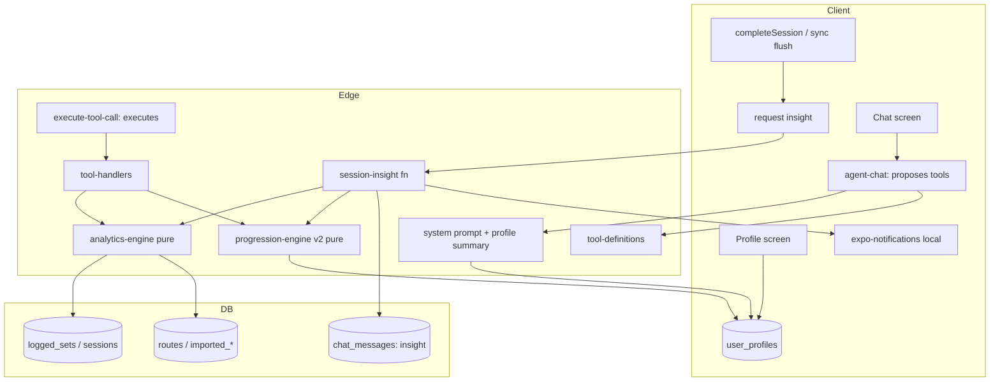

# Design: Cadence AI Coach — Unified Workout Intelligence Uplift

## Goals

- Data-aware coaching: trends, muscle balance, consistency/adherence, PR history, cardio pace trends.
- Unified strength + cardio + recovery decisioning (poor recovery dampens both lifting and running load).
- Rich user profile injected into the agent for personalized, goal-aligned, injury/equipment-safe advice.
- Proactive, approval-gated suggestions surfaced in-chat and via local notification.

## Non-negotiable constraints

- The agent (`agent-chat`) only **proposes** tool calls. It never executes them.
- Execution happens in `execute-tool-call` after the client approves.
- Every tool must be registered in `TOOL_PERMISSION_MAP` (`_shared/tool-executor.ts`) so
  permission gating + audit logging apply. Categories: program_edits, journal_edits,
  spotify_actions, health_access.
- All program mutations remain behind the `program_edits` approval gate.
- Client is Expo SDK 57 — verify API shapes against https://docs.expo.dev/versions/v57.0.0/.

## Architecture

## Module responsibilities

- `_shared/analytics-engine.ts` — **pure** functions over already-shaped inputs. No DB access.
  Strength: volume trend, per-muscle weekly volume + balance, estimated-1RM/PR history, adherence.
  Cardio: pace/speed trend, per-distance-bucket, weekly load, elevation-adjusted pace.
- `_shared/progression-engine.ts` (v2) — **pure**, deterministic. Consumes analytics + recovery + profile.
  Adds cardio rules, goal weighting, experience scaling, injury/equipment guardrails, unified recovery.
- `_shared/tool-handlers.ts` — DB-querying handlers that assemble inputs and call the pure modules.
- `agent-chat/index.ts` — builds the system prompt (now with profile summary) and streams proposals.
- `session-insight` — runs analytics + progression v2 for a completed session, persists one insight.

## Data model additions

- `user_profiles`: goal, experience_level, bodyweight, bodyweight_unit, injuries (text),
  equipment (text[]), preferred_training_days (text[]/int), weekly_frequency (int),
  training_notes (text). RLS scoped to `auth.uid() = user_id`.
- `personal_records` (existing, currently unused): backfilled/written on `get_pr_history` reads.

## Testing strategy

- Pure modules (analytics-engine, progression-engine): Vitest unit tests with fixtures.
- Handlers: Vitest with a mocked Supabase client asserting query shape + aggregates.
- Profile service: upsert/read + RLS policy test (per postgres best-practices skill).
- Proactive: insight generation from a seeded session; actionable ⇒ pending_approval.

## Delivered (final)

Tools added to the coach (all in TOOL_PERMISSION_MAP + tool-definitions + tool-handlers):
- get_training_analytics, get_pr_history, get_cardio_analytics (health_access)
- critique_program, suggest_progression [rewritten: server-assembled, unified] (program_edits)
- get_recovery_summary rewritten to average across the window + expose an HRV baseline.

New shared modules:
- _shared/analytics-engine.ts — pure strength + cardio analytics + program critique.
- _shared/progression-engine.ts — base engine (unchanged) + evaluateProgressionV2 (unified, profile-aware).
- _shared/profile-summary.ts — buildProfileSummary/composeSystemPrompt for prompt injection.
- _shared/session-insight.ts — buildSessionInsight (pure) for the proactive loop.

New edge function: session-insight (proactive; persists to chat_messages; actionable ⇒ pending_approval).

Client: user_profiles table + migration (RLS verified), src/services/profile.ts, Training Profile
screen under Settings, src/services/session-insight.ts trigger wired into both session-completion
paths, scheduleInsightNotification (local notification, deep-link payload to chat).

Tests: 35 files / 558 tests pass. Client tsc adds no new errors (pre-existing strictness issues
in untouched files remain).

Follow-ups (now resolved):
- Notification-tap deep-link: useNotificationDeepLink() in notifications.ts, wired at the app root
  (_layout.tsx), routes to the notification's data.route on tap (cold-start + warm).
- exercises.equipment column added (migration 20250101000017); assembleProgramTargets surfaces it and
  critique_program now performs a live equipment-mismatch check against the user's profile equipment.
