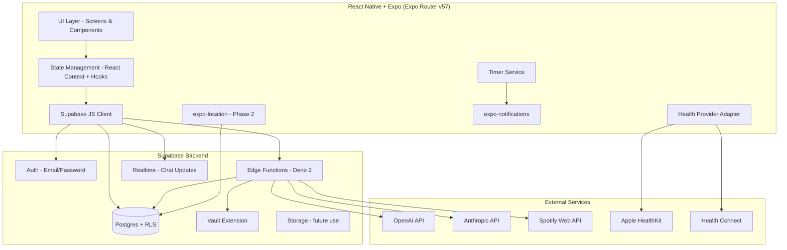

# Design Document: Cadence Fitness App

## Overview

Cadence is a mobile-first fitness application built with React Native + Expo (Expo Router v57) on a Supabase backend. It pairs users with an AI training agent (powered by user-supplied OpenAI/Anthropic API keys) for personalized program creation, session logging, timer management, progression tracking, and Spotify playlist curation. Phase 2 extends the app with background GPS route tracking stored via PostGIS.

### Key Design Decisions

1. **Expo Dev Client (not Expo Go)**: Required for MVP because HealthKit and Health Connect integrations are in-scope for MVP — these native health SDKs cannot run in Expo Go. The app uses `expo prebuild` for custom native builds. Phase 2 route tracking adds an additional native/background-location evaluation on top of this existing requirement, but the Dev Client decision is driven by MVP health provider needs, not deferred to phase 2.
2. **BYOK (Bring Your Own Key)**: Users supply their own AI API keys. Keys are encrypted at rest in Supabase Vault and decrypted only within Edge Functions at call time.
3. **Server-side Agent execution**: All AI interactions run in Supabase Edge Functions (Deno 2). The client never touches AI APIs directly, ensuring key security and auditability.
4. **Tool Call architecture**: The Agent produces structured tool calls; the Edge Function validates permissions, executes them, and returns results. This provides a clear audit trail and permission gating.
5. **Single active program constraint**: Enforced at the database level via a partial unique index ensuring at most one `status = 'active'` program per user.
6. **Timer notifications via scheduled local notifications**: Using `expo-notifications` `scheduleNotificationAsync` with exact countdown triggers — no background execution needed for timer alerts.
7. **Health data normalization**: Raw HealthKit/Health Connect data is stored verbatim in an ingestion layer (`health_data_raw`), then normalized into typed domain tables (imported workouts, sleep summaries, activity snapshots, heart rate summaries) for feature and Agent consumption.
8. **PostGIS for routes (Phase 2)**: Route geometry stored as `geography(LineStringZ, 4326)` with GIST spatial index for accurate distance calculations.

## Architecture



### Architectural Layers

| Layer | Responsibility |
|-------|---------------|
| **UI Layer** | Expo Router screens, navigation, components, theming |
| **State Layer** | React Context providers for auth, session, program, chat |
| **Data Layer** | Supabase JS client, typed queries, realtime subscriptions |
| **Edge Functions** | Agent orchestration, tool call execution, Spotify API proxy, key decryption |
| **Database** | Postgres with RLS, Vault for encryption, PostGIS for routes |

## Components and Interfaces

### 1. Authentication Module

```typescript
// src/providers/AuthProvider.tsx
interface AuthState {
  user: User | null;
  session: Session | null;
  isLoading: boolean;
}

// Supabase Auth with email/password
// Email verification required before full access
// Generic error messages on failure (no email enumeration)
```

### 2. Agent Chat Module

```typescript
// src/services/agent.ts
interface ChatMessage {
  id: string;
  role: 'user' | 'assistant' | 'system';
  content: string;
  tool_calls?: ToolCall[];
  created_at: string;
}

interface ToolCall {
  id: string;
  type: string; // 'program_create' | 'program_modify' | 'journal_draft' | 'spotify_*'
  parameters: Record<string, unknown>;
  status: 'pending_approval' | 'approved' | 'auto_applied' | 'rejected';
  result?: Record<string, unknown>;
}

// Edge Function: POST /functions/v1/agent-chat
// - Receives user message + conversation context
// - Decrypts user's API key from Vault
// - Calls OpenAI/Anthropic with tool definitions
// - Returns assistant response + any tool calls
// - Streams response via Supabase Realtime
```

#### Agent Health Data Access Boundary

The Agent SHALL access only normalized Cadence-owned summaries of imported health data via server-side Tool_Calls. The Agent SHALL NOT access raw provider records directly, nor perform arbitrary database reads. All health data available to the Agent flows through defined Edge Function tool contracts that return pre-shaped summaries (e.g., `get_recovery_summary`, `get_recent_workouts_summary`). This ensures:
- Raw `health_data_raw` records are never exposed to the LLM context
- The Agent cannot construct ad-hoc queries against health tables
- All data shaping and filtering happens in deterministic, auditable Edge Function code

### 3. Program Management Module

```typescript
// src/types/program.ts
interface Program {
  id: string;
  user_id: string;
  name: string;
  status: 'active' | 'archived' | 'draft';
  program_days: ProgramDay[];
  modification_history: ModificationEntry[];
  created_at: string;
  updated_at: string;
}

// Transactional Program Activation
// The activate_program() Postgres function atomically archives the current
// active program and sets the new one as active within a single transaction.
// This eliminates client-side retry logic and race conditions around the
// partial unique index (idx_one_active_program_per_user).
//
// Usage: SELECT activate_program(p_user_id, p_new_program_id);
// See Data Models section for the function definition.

interface ProgramDay {
  id: string;
  program_id: string;
  day_number: number;
  name: string;
  items: ProgramDayItem[]; // exercises or blocks
}

interface ProgramDayItem {
  id: string;
  type: 'exercise' | 'block';
  order: number;
  exercise_id?: string;
  block?: Block;
  target_sets: number;
  target_reps: string; // e.g. "8-12" or "5"
  target_weight?: number;
  target_rpe?: number;
  timer_config?: TimerConfig;
  notes?: string;
}

interface Block {
  id: string;
  name: string;
  type: 'circuit' | 'superset' | 'amrap' | 'custom';
  exercises: ProgramDayItem[];
  timer_config?: TimerConfig;
}
```

### 4. Session Logging Module

```typescript
// src/types/session.ts
interface Session {
  id: string;
  user_id: string;
  program_day_id: string;
  status: 'in_progress' | 'completed';
  started_at: string;
  completed_at?: string;
  logged_sets: LoggedSet[];
  block_completions: BlockCompletion[];
  route_id?: string; // Phase 2
}

interface LoggedSet {
  id: string;
  session_id: string;
  exercise_id: string;
  set_number: number;
  reps: number;
  weight: number;
  rpe?: number;
  notes?: string;
  is_pr: boolean;
  pr_type?: 'weight' | 'reps_at_weight' | 'estimated_1rm';
  actual_duration_seconds?: number; // only for individual exercise timer results (countdown/duration types)
  logged_at: string;
}

interface BlockCompletion {
  id: string;
  session_id: string;
  block_id: string;
  actual_duration_seconds: number;
  actual_rounds: number;
  completed_at: string;
}

// Block completions capture per-block timer results when one block timer
// covers multiple exercises (e.g., circuit, superset, AMRAP).
// LoggedSet.actual_duration_seconds is only for individual exercise timers.

// Auto-fill logic:
// 1. Previous set in same session for same exercise
// 2. Most recent completed session for same ProgramDay
// 3. Most recent exercise history across all sessions
// 4. Program plan targets as final fallback
```

### 5. Timer Service

```typescript
// src/services/timer.ts
interface TimerConfig {
  type: 'none' | 'rest' | 'countdown' | 'interval' | 'duration';
  work_seconds?: number;
  rest_seconds?: number;
  rounds?: number;
  duration_seconds?: number;
}

interface TimerState {
  status: 'idle' | 'running' | 'paused' | 'completed';
  remaining_seconds: number;
  current_round?: number;
  total_rounds?: number;
  elapsed_seconds: number;
  phase?: 'work' | 'rest';
}

// Implementation:
// - Uses requestAnimationFrame / setInterval for UI countdown
// - Schedules expo-notifications at timer start for background alert
// - Cancels scheduled notification if timer is manually stopped
// - Records actual duration on completion
```

### 6. Health Provider Adapter

```typescript
// src/services/health/types.ts

// --- Ingestion Layer (raw provider records stored as-is) ---
interface RawHealthRecord {
  id: string;
  user_id: string;
  provider: 'apple_healthkit' | 'health_connect';
  provider_record_id: string;
  data_type: 'workout' | 'heart_rate' | 'sleep' | 'activity' | 'body_metrics';
  raw_payload: Record<string, unknown>; // provider-native format, stored verbatim
  recorded_at: string;
  synced_at: string;
  sync_status: 'synced' | 'pending';
}

// --- Normalized Domain Models (typed, queryable by features and Agent) ---
interface ImportedWorkout {
  id: string;
  user_id: string;
  raw_record_id: string; // FK to health_data_raw
  provider: 'apple_healthkit' | 'health_connect';
  provider_record_id: string;
  workout_type: string;
  start_time: string;
  end_time: string;
  duration_seconds: number;
  distance_meters?: number;
  average_pace_seconds_per_km?: number;
  average_speed_kmh?: number;
  elevation_gain_meters?: number;
  route_data?: GeoPoint[]; // read-only in MVP
  synced_at: string;
}

interface ImportedSleepSummary {
  id: string;
  user_id: string;
  raw_record_id: string;
  provider: 'apple_healthkit' | 'health_connect';
  date: string;
  total_duration_minutes: number;
  deep_minutes?: number;
  light_minutes?: number;
  rem_minutes?: number;
  awake_minutes?: number;
  synced_at: string;
}

interface ImportedActivitySnapshot {
  id: string;
  user_id: string;
  raw_record_id: string;
  provider: 'apple_healthkit' | 'health_connect';
  date: string;
  steps?: number;
  active_calories?: number;
  hrv_ms?: number;
  vo2_max?: number;
  synced_at: string;
}

interface ImportedHeartRateSummary {
  id: string;
  user_id: string;
  raw_record_id: string;
  provider: 'apple_healthkit' | 'health_connect';
  date: string;
  resting_bpm?: number;
  average_bpm?: number;
  max_bpm?: number;
  synced_at: string;
}

// Convenience aggregate for UI and Agent consumption
interface NormalizedHealthData {
  workouts: ImportedWorkout[];
  heart_rate: ImportedHeartRateSummary | null;
  sleep: ImportedSleepSummary | null;
  activity: ImportedActivitySnapshot | null;
}

// Platform-specific implementations:
// iOS: @kingstinct/react-native-healthkit (Expo config plugin available)
// Android: react-native-health-connect + expo-health-connect config plugin
// Both require Expo Dev Client (not Expo Go)
//
// Import pipeline:
// 1. Fetch from native SDK → store verbatim in health_data_raw (ingestion layer)
// 2. Normalize into typed domain tables (imported_workouts, imported_sleep_summaries,
//    imported_activity_snapshots, imported_heart_rate_summaries)
// 3. Agent accesses ONLY normalized domain tables via Tool_Call contracts
```

### 7. Spotify Integration Module

```typescript
// src/services/spotify.ts
// OAuth2 PKCE flow via expo-auth-session + expo-web-browser

interface SpotifyAuth {
  access_token: string;
  refresh_token: string;
  expires_at: number;
  scopes: string[];
}

// Scopes requested (phase 1):
// - playlist-read-private
// - playlist-modify-public
// - playlist-modify-private

// Token storage: encrypted in Supabase (user_spotify_tokens table)
// Token refresh: handled server-side in Edge Functions
// Disconnect: revokes tokens, deletes from DB
```

### 8. PR Detection Engine

```typescript
// src/services/pr-detection.ts
interface PRCheck {
  exercise_id: string;
  weight: number;
  reps: number;
  estimated_1rm: number;
}

interface PRResult {
  is_pr: boolean;
  pr_type?: 'weight' | 'reps_at_weight' | 'estimated_1rm';
  previous_best?: number;
  new_best?: number;
}

// Estimated 1RM formula: Brzycki = weight × (36 / (37 - reps))
// PR detection runs client-side against cached history
// Confirmed server-side on session completion
```

### 9. Permission & Audit System

```typescript
// src/types/permissions.ts
type PermissionCategory = 'program_edits' | 'journal_edits' | 'spotify_actions';
type PermissionMode = 'approval_required' | 'auto_apply';

interface AuditLogEntry {
  id: string;
  user_id: string;
  timestamp: string;
  action_type: string;
  permission_category: PermissionCategory;
  parameters: Record<string, unknown>;
  approval_status: 'approved' | 'auto_applied' | 'rejected';
  outcome: 'success' | 'failure';
  error_message?: string;
}
```

### 10. Route Tracking Module (Phase 2)

```typescript
// src/services/route-tracking.ts
interface RoutePoint {
  latitude: number;
  longitude: number;
  timestamp: string;
  elevation?: number;
  speed?: number;
}

interface Route {
  id: string;
  user_id: string;
  session_id?: string;
  program_day_id?: string;
  points: RoutePoint[];
  distance_meters: number;
  duration_seconds: number;
  average_pace_seconds_per_km: number;
  average_speed_kmh: number;
  elevation_gain_meters?: number;
  created_at: string;
}

// Background tracking:
// - expo-location startLocationUpdatesAsync with TaskManager
// - Requires Expo Dev Client with custom native module configuration
// - Feasibility assessment required before committing approach
//   (expo-location managed vs. react-native-background-geolocation)
// - Storage: PostGIS geography(LineStringZ, 4326) with GIST index
```

## Data Models

### Entity Relationship Diagram

```mermaid
erDiagram
    users ||--o{ programs : owns
    users ||--o{ sessions : logs
    users ||--o{ exercises : creates
    users ||--o| user_settings : has
    users ||--o| user_api_keys : has
    users ||--o| user_spotify_tokens : has
    users ||--o{ audit_log : generates
    users ||--o{ journal_entries : writes
    users ||--o{ health_data_raw : ingests
    users ||--o{ imported_workouts : normalizes
    users ||--o{ imported_sleep_summaries : normalizes
    users ||--o{ imported_activity_snapshots : normalizes
    users ||--o{ imported_heart_rate_summaries : normalizes
    users ||--o{ routes : tracks

    programs ||--|{ program_days : contains
    program_days ||--|{ program_day_items : contains
    program_day_items }o--|| exercises : references
    program_day_items ||--o| blocks : groups_into

    sessions }o--|| program_days : based_on
    sessions ||--|{ logged_sets : contains
    sessions ||--o{ block_completions : records
    sessions ||--o| routes : linked_to
    sessions ||--o| journal_entries : reflected_in

    blocks ||--o{ block_completions : timed_in

    exercises ||--o{ logged_sets : tracked_in
    exercises ||--o{ personal_records : achieved_on

    programs ||--o{ modification_history : records

    health_data_raw ||--o| imported_workouts : normalized_to
    health_data_raw ||--o| imported_sleep_summaries : normalized_to
    health_data_raw ||--o| imported_activity_snapshots : normalized_to
    health_data_raw ||--o| imported_heart_rate_summaries : normalized_to

    users {
        uuid id PK
        string email
        timestamp created_at
    }

    programs {
        uuid id PK
        uuid user_id FK
        string name
        enum status "active|archived|draft"
        timestamp created_at
        timestamp updated_at
    }

    program_days {
        uuid id PK
        uuid program_id FK
        int day_number
        string name
        timestamp created_at
    }

    program_day_items {
        uuid id PK
        uuid program_day_id FK
        uuid exercise_id FK
        uuid block_id FK
        enum type "exercise|block"
        int order_index
        int target_sets
        string target_reps
        numeric target_weight
        numeric target_rpe
        jsonb timer_config
        text notes
    }

    blocks {
        uuid id PK
        uuid program_day_id FK
        string name
        enum type "circuit|superset|amrap|custom"
        jsonb timer_config
    }

    exercises {
        uuid id PK
        uuid user_id FK "null for global"
        string name
        string primary_muscle_group
        text[] secondary_muscle_groups
        text instructions
        text notes
        boolean is_global
    }

    sessions {
        uuid id PK
        uuid user_id FK
        uuid program_day_id FK
        uuid route_id FK
        enum status "in_progress|completed"
        timestamp started_at
        timestamp completed_at
        int total_duration_seconds
    }

    logged_sets {
        uuid id PK
        uuid session_id FK
        uuid exercise_id FK
        int set_number
        int reps
        numeric weight
        numeric rpe
        text notes
        boolean is_pr
        enum pr_type "weight|reps_at_weight|estimated_1rm"
        int actual_duration_seconds "individual exercise timer only"
        timestamp logged_at
    }

    block_completions {
        uuid id PK
        uuid session_id FK
        uuid block_id FK
        int actual_duration_seconds
        int actual_rounds
        timestamp completed_at
    }

    personal_records {
        uuid id PK
        uuid user_id FK
        uuid exercise_id FK
        enum pr_type
        numeric value
        uuid session_id FK
        timestamp achieved_at
    }

    user_settings {
        uuid id PK
        uuid user_id FK
        enum program_edits_permission "approval_required|auto_apply"
        enum journal_edits_permission "approval_required|auto_apply"
        enum spotify_actions_permission "approval_required|auto_apply"
        boolean health_connected
        string health_provider
    }

    user_api_keys {
        uuid id PK
        uuid user_id FK
        text openai_key_encrypted "Vault encrypted"
        text anthropic_key_encrypted "Vault encrypted"
        timestamp updated_at
    }

    user_spotify_tokens {
        uuid id PK
        uuid user_id FK
        text access_token_encrypted
        text refresh_token_encrypted
        timestamp expires_at
        text[] scopes
    }

    audit_log {
        uuid id PK
        uuid user_id FK
        timestamp created_at
        string action_type
        enum permission_category
        jsonb parameters
        enum approval_status "approved|auto_applied|rejected"
        enum outcome "success|failure"
        text error_message
    }

    journal_entries {
        uuid id PK
        uuid user_id FK
        uuid session_id FK
        text content
        boolean agent_drafted
        timestamp created_at
        timestamp updated_at
    }

    chat_messages {
        uuid id PK
        uuid user_id FK
        enum role "user|assistant|system"
        text content
        jsonb tool_calls
        timestamp created_at
    }

    health_data_raw {
        uuid id PK
        uuid user_id FK
        string provider "apple_healthkit|health_connect"
        string provider_record_id
        string data_type "workout|heart_rate|sleep|activity|body_metrics"
        jsonb raw_payload "provider-native format, stored verbatim"
        timestamp recorded_at
        timestamp synced_at
        enum sync_status "synced|pending"
    }

    imported_workouts {
        uuid id PK
        uuid user_id FK
        uuid raw_record_id FK
        string provider
        string provider_record_id
        string workout_type
        timestamp start_time
        timestamp end_time
        int duration_seconds
        numeric distance_meters
        numeric avg_pace_sec_per_km
        numeric avg_speed_kmh
        numeric elevation_gain_meters
        jsonb route_data "read-only in MVP"
        timestamp synced_at
    }

    imported_sleep_summaries {
        uuid id PK
        uuid user_id FK
        uuid raw_record_id FK
        string provider
        date date
        int total_duration_minutes
        int deep_minutes
        int light_minutes
        int rem_minutes
        int awake_minutes
        timestamp synced_at
    }

    imported_activity_snapshots {
        uuid id PK
        uuid user_id FK
        uuid raw_record_id FK
        string provider
        date date
        int steps
        numeric active_calories
        numeric hrv_ms
        numeric vo2_max
        timestamp synced_at
    }

    imported_heart_rate_summaries {
        uuid id PK
        uuid user_id FK
        uuid raw_record_id FK
        string provider
        date date
        int resting_bpm
        int average_bpm
        int max_bpm
        timestamp synced_at
    }

    modification_history {
        uuid id PK
        uuid program_id FK
        uuid user_id FK
        string change_type
        jsonb before_state
        jsonb after_state
        string source "user|agent"
        timestamp created_at
    }

    routes {
        uuid id PK
        uuid user_id FK
        uuid session_id FK
        uuid program_day_id FK
        geography geometry "LineStringZ 4326"
        jsonb point_stream "full GPS data with timestamps"
        numeric distance_meters
        int duration_seconds
        numeric avg_pace_sec_per_km
        numeric avg_speed_kmh
        numeric elevation_gain_meters
        timestamp created_at
    }
```



### Row Level Security Strategy

All user-owned tables enforce RLS with policies following this pattern:

```sql
-- Example: programs table
ALTER TABLE programs ENABLE ROW LEVEL SECURITY;

CREATE POLICY "Users can only access own programs"
  ON programs FOR ALL
  USING (auth.uid() = user_id)
  WITH CHECK (auth.uid() = user_id);

-- Global exercises: readable by all authenticated users
CREATE POLICY "Global exercises are readable"
  ON exercises FOR SELECT
  USING (is_global = true OR auth.uid() = user_id);

CREATE POLICY "Users can only modify own exercises"
  ON exercises FOR ALL
  USING (auth.uid() = user_id AND is_global = false)
  WITH CHECK (auth.uid() = user_id AND is_global = false);
```

### Single Active Program Constraint

```sql
-- Enforced at DB level: only one active program per user
CREATE UNIQUE INDEX idx_one_active_program_per_user
  ON programs (user_id)
  WHERE status = 'active';
```

### API Key Encryption (Supabase Vault)

```sql
-- Keys stored via Vault's Transparent Column Encryption
-- Decryption only happens in Edge Functions via SECURITY DEFINER functions
CREATE OR REPLACE FUNCTION get_user_api_key(p_user_id uuid, p_provider text)
RETURNS text
LANGUAGE plpgsql
SECURITY DEFINER
SET search_path = ''
AS $$
DECLARE
  v_key text;
BEGIN
  -- Only callable from service_role (Edge Functions)
  IF current_setting('request.jwt.claims', true)::json->>'role' != 'service_role' THEN
    RAISE EXCEPTION 'Unauthorized';
  END IF;

  SELECT CASE
    WHEN p_provider = 'openai' THEN vault.decrypted_secrets.decrypted_secret
    WHEN p_provider = 'anthropic' THEN vault.decrypted_secrets.decrypted_secret
  END INTO v_key
  FROM user_api_keys k
  JOIN vault.decrypted_secrets ON ...
  WHERE k.user_id = p_user_id;

  RETURN v_key;
END;
$$;
```

### Transactional Program Activation

```sql
-- Atomically archives the current active program and activates the new one.
-- Eliminates client-side retry logic and race conditions around the partial unique index.
CREATE OR REPLACE FUNCTION activate_program(p_user_id uuid, p_program_id uuid)
RETURNS void
LANGUAGE plpgsql
SECURITY DEFINER
SET search_path = ''
AS $$
BEGIN
  -- Archive currently active program (if any)
  UPDATE public.programs
  SET status = 'archived', updated_at = now()
  WHERE user_id = p_user_id AND status = 'active';

  -- Activate the requested program
  UPDATE public.programs
  SET status = 'active', updated_at = now()
  WHERE id = p_program_id AND user_id = p_user_id;

  IF NOT FOUND THEN
    RAISE EXCEPTION 'Program not found or not owned by user';
  END IF;
END;
$$;

-- Callable from Edge Functions or client via supabase.rpc('activate_program', {...})
-- The SECURITY DEFINER context ensures atomicity even under concurrent requests.
```


## Correctness Properties

*A property is a characteristic or behavior that should hold true across all valid executions of a system — essentially, a formal statement about what the system should do. Properties serve as the bridge between human-readable specifications and machine-verifiable correctness guarantees.*

### Property 1: Single Active Program Invariant

*For any* user and any sequence of program creation and activation operations, there SHALL be at most one program with `status = 'active'` for that user at any point in time. Activating a new program archives the previously active one.

**Validates: Requirements 4.1, 4.2**

### Property 2: Permission Gating

*For any* Tool_Call and any Permission_Category, if the category is set to `approval_required`, the tool call SHALL NOT be applied without explicit user confirmation; if set to `auto_apply`, the tool call SHALL be applied immediately. The gating decision is determined solely by the category's current mode.

**Validates: Requirements 2.3, 2.4, 6.1, 23.3, 23.4**

### Property 3: API Key Secrecy

*For any* stored API key (OpenAI or Anthropic), no client-bound API response or Supabase query result accessible to the `authenticated` role SHALL contain the decrypted key value. Only Edge Functions running as `service_role` can access decrypted keys.

**Validates: Requirements 3.2, 29.2**

### Property 4: Modification History Completeness

*For any* modification to an active program (whether initiated by user or Agent), the system SHALL create exactly one modification_history entry containing the before state, after state, change type, and source.

**Validates: Requirements 5.3, 6.2**

### Property 5: Exercise Search Completeness

*For any* search query issued by an authenticated user, the results SHALL include all matching exercises from both the global library and the user's private exercises, and SHALL NOT include private exercises belonging to other users.

**Validates: Requirements 7.3**

### Property 6: Global Exercise Immutability

*For any* user and any global exercise, update and delete operations on that exercise SHALL be rejected regardless of the user's authentication status.

**Validates: Requirements 7.4**

### Property 7: Exercise Validation

*For any* exercise creation payload, if the payload is missing a `name` or a `primary_muscle_group`, the system SHALL reject the creation and leave the exercise table unchanged.

**Validates: Requirements 8.2**

### Property 8: Session Auto-Fill Priority Chain

*For any* exercise in a new session, the pre-populated values SHALL follow this priority: (1) most recent completed session for the same ProgramDay, (2) most recent exercise history across all sessions, (3) program plan targets. A higher-priority source always takes precedence when available.

**Validates: Requirements 9.1, 9.2, 9.3**

### Property 9: Intra-Session Set Auto-Fill

*For any* exercise within an active session, adding a new set SHALL auto-fill weight, reps, and RPE from the most recently logged set for that exercise in the current session. If the user manually overrides a value, subsequent auto-fills SHALL carry forward the overridden value.

**Validates: Requirements 10.1, 10.2**

### Property 10: Volume Calculation Correctness

*For any* completed session with a list of logged sets, the total estimated volume SHALL equal the sum of (reps × weight) across all logged sets in that session.

**Validates: Requirements 11.1**

### Property 11: Health Data Normalization Round-Trip

*For any* valid raw health data record (with any subset of fields present or absent), normalization SHALL succeed without error, producing a valid `NormalizedHealthData` object that preserves source metadata (provider, provider_record_id, timestamps, sync_status) and gracefully omits unavailable fields as null.

**Validates: Requirements 13.2, 14.1, 14.2**

### Property 12: Health Data Non-Interference

*For any* health data import operation, the user's existing programs, program_days, program_day_items, and logged_sets SHALL remain unchanged.

**Validates: Requirements 14.4**

### Property 13: Timer State Consistency

*For any* valid `TimerConfig`, initializing the timer SHALL produce a correct initial `TimerState` (remaining seconds matching config, correct phase and round). When the timer runs to completion, the recorded actual_duration and actual_rounds SHALL be consistent with the elapsed time and configured rounds.

**Validates: Requirements 16.1, 18.1, 18.2**

### Property 14: Timer Defaults Priority

*For any* ProgramDay, if at least one prior session has been completed for it, timer values SHALL default from the most recent completed session. If no prior session exists, timer values SHALL default from the program plan presets.

**Validates: Requirements 17.1, 17.2**

### Property 15: PR Detection Correctness

*For any* logged set and any exercise history, PR detection SHALL correctly identify whether the set constitutes a new personal record for: (a) best weight lifted, (b) best reps at a given weight, or (c) best estimated 1RM. A PR is detected if and only if the set's value exceeds all prior values in the user's full history for that exercise and PR type.

**Validates: Requirements 20.1, 20.2**

### Property 16: Volume by Muscle Group Aggregation

*For any* time window and collection of sessions within that window, the volume-by-muscle-group summary SHALL equal the sum of (reps × weight) for all logged sets, grouped by each exercise's primary_muscle_group.

**Validates: Requirements 21.2**

### Property 17: Activity Summary Isolation

*For any* collection of sessions containing both Cadence-completed sessions and passively imported Health_Provider sessions, the activity summary (frequency, total volume) SHALL count only Cadence-completed sessions unless the user has explicitly linked an imported session to a ProgramDay.

**Validates: Requirements 21.3**

### Property 18: Default Permission Settings

*For any* newly created user account, all Permission_Categories (program_edits, journal_edits, spotify_actions) SHALL default to `approval_required`.

**Validates: Requirements 23.2**

### Property 19: Audit Log Completeness

*For any* Agent Tool_Call execution (regardless of outcome), the system SHALL create an audit log entry containing: timestamp, action_type, permission_category, parameters, approval_status, and outcome.

**Validates: Requirements 24.1**

### Property 20: Data Isolation

*For any* two distinct users A and B, querying any user-owned table with user A's authenticated credentials SHALL return zero rows belonging to user B.

**Validates: Requirements 28.2**

### Property 21: Route Statistics Derivation (Phase 2)

*For any* set of GPS points with timestamps, storing a route SHALL compute and persist correct derived statistics: total distance (sum of haversine distances between consecutive points), total duration (last timestamp - first timestamp), average pace, and average speed. When elevation data is unavailable, the system SHALL store distance, duration, pace, and speed without error.

**Validates: Requirements 32.2**

## Error Handling

### Client-Side Error Strategy

| Error Type | Handling |
|-----------|----------|
| Network failure | Retry with exponential backoff (3 attempts). Show inline error with retry button. |
| Auth token expired | Auto-refresh via Supabase client. If refresh fails, redirect to login. |
| Validation error | Show field-level error messages. Prevent submission. |
| API key missing/invalid | Navigate to key configuration screen with explanation. |
| Health permission denied | Gracefully degrade; all features work without health data. |
| Timer scheduling failure | Fall back to in-app alert; log warning. |

### Server-Side Error Strategy (Edge Functions)

| Error Type | Handling |
|-----------|----------|
| AI API rate limit | Return 429 with retry-after header. Client shows "Agent busy" message. |
| AI API key invalid | Return structured error. Client prompts key re-entry. |
| AI API timeout | 30-second timeout. Return partial response if available, error otherwise. |
| Tool call failure | Log to audit_log with `outcome: 'failure'`. Return error to chat. |
| Spotify token expired | Auto-refresh server-side. If refresh fails, prompt reconnection. |
| Vault decryption failure | Return 500. Do not leak vault internals. |

### Database Error Strategy

| Error Type | Handling |
|-----------|----------|
| RLS violation | Supabase returns empty result set. Client shows "not found." |
| Unique constraint (active program) | Handled atomically by the `activate_program` server-side function (see Program Management Module). No client-side retry needed. |
| Foreign key violation | Return validation error to client. |
| PostGIS computation error | Fall back to simplified stats (pace/speed only). |

## Testing Strategy

### Dual Testing Approach

This project uses both example-based unit tests and property-based tests for comprehensive coverage.

### Property-Based Testing

**Library:** [fast-check](https://github.com/dubzzz/fast-check) (TypeScript PBT library)

**Configuration:**
- Minimum 100 iterations per property test
- Each property test references its design document property
- Tag format: `Feature: cadence-fitness-app, Property {N}: {title}`

**Properties suitable for PBT:**

| Property | Domain | What Varies |
|----------|--------|-------------|
| 1: Single Active Program | Program state machine | Sequences of create/activate operations |
| 2: Permission Gating | Permission logic | Tool call types × permission modes |
| 7: Exercise Validation | Input validation | Exercise creation payloads (valid/invalid) |
| 8: Auto-Fill Priority | Lookup logic | Session history availability combinations |
| 9: Intra-Session Auto-Fill | State carry-forward | Set sequences with/without manual overrides |
| 10: Volume Calculation | Arithmetic | Random sets with varying reps/weight |
| 11: Health Normalization | Data transformation | Raw health records with random field presence |
| 13: Timer State | State initialization | All timer config types and values |
| 15: PR Detection | Comparison logic | Sets vs random exercise histories |
| 16: Volume by Muscle Group | Aggregation | Random sessions with random exercises |
| 21: Route Stats | Geographic computation | Random GPS point sequences |

### Unit Tests (Example-Based)

Focus areas for example-based unit tests:
- Authentication flows (login, register, email verification)
- Agent chat message handling
- Spotify OAuth flow
- Journal CRUD operations
- UI component rendering
- Edge Function request/response formats
- Timer notification scheduling
- Account deletion cascade

### Integration Tests

Focus areas:
- Supabase RLS policy enforcement (multi-user scenarios)
- Edge Function → AI API → Tool Call execution
- Health Provider data import pipeline
- Spotify token refresh flow
- Background location tracking (Phase 2, on-device)

### Test Infrastructure

```
tests/
├── unit/
│   ├── services/
│   │   ├── pr-detection.test.ts
│   │   ├── volume-calculator.test.ts
│   │   ├── timer-service.test.ts
│   │   ├── auto-fill.test.ts
│   │   └── health-normalizer.test.ts
│   ├── models/
│   │   ├── program.test.ts
│   │   └── exercise.test.ts
│   └── utils/
│       └── route-stats.test.ts
├── property/
│   ├── program-invariants.prop.ts
│   ├── permission-gating.prop.ts
│   ├── pr-detection.prop.ts
│   ├── auto-fill-priority.prop.ts
│   ├── volume-calculation.prop.ts
│   ├── timer-state.prop.ts
│   ├── health-normalization.prop.ts
│   ├── exercise-validation.prop.ts
│   └── route-stats.prop.ts
├── integration/
│   ├── rls-policies.test.ts
│   ├── agent-chat.test.ts
│   ├── spotify-flow.test.ts
│   └── health-import.test.ts
└── setup/
    └── test-helpers.ts
```

### Test Runner

- **Vitest** for unit and property tests (fast, TypeScript-native, compatible with Expo)
- Run with `vitest --run` for CI (no watch mode)
- Integration tests run against local Supabase (`supabase start`)
