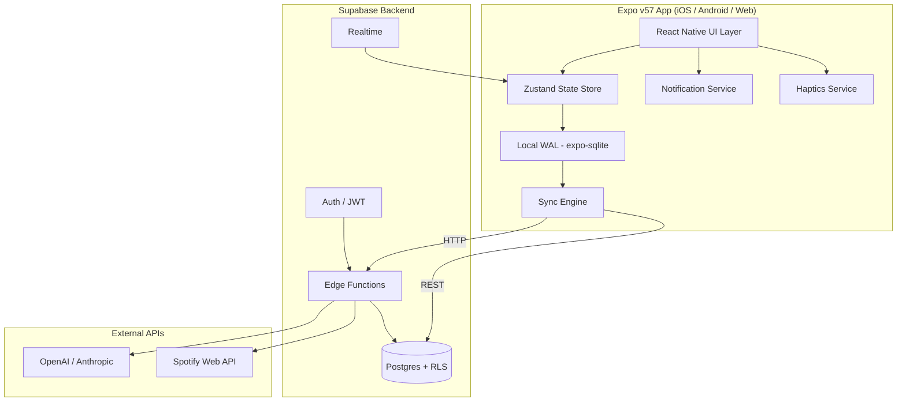
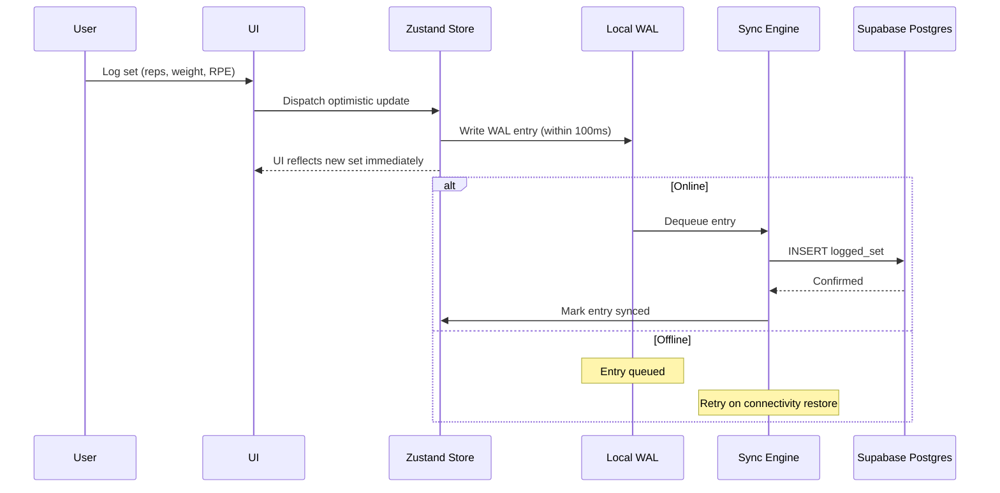
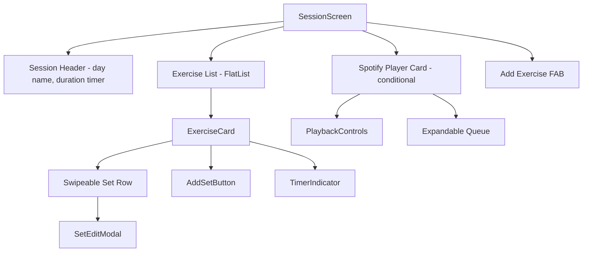

# Design Document: Cadence V2 Roadmap

## Overview

Cadence V2 extends the existing Expo v57 + Supabase fitness app with seven improvement layers: critical bug fixes (tool call execution), offline-first session logging, manual CRUD & exercise library, client-side state management, progress visualization, UX polish (haptics, auto-timers, notifications), and subscription readiness. The AI chat remains the primary interaction path; manual features serve power users who want direct control.

The design prioritizes:
- **Offline-first**: All session operations persist to a local WAL (expo-sqlite) before syncing to Supabase, ensuring zero data loss.
- **Optimistic UI**: State updates appear within 100ms via a Zustand store backed by the local WAL.
- **Incremental delivery**: Each phase builds on the previous without breaking existing flows.
- **Future extensibility**: Entitlement tables, coach/athlete schema hooks, and RLS policy patterns allow subscription gating and multi-tenancy without schema rewrites.

## Architecture

### High-Level System Diagram



### Architecture Layers

| Layer | Technology | Responsibility |
|-------|-----------|---------------|
| Presentation | React Native + Expo Router (file-based) | Screens, navigation, gesture handling |
| State | Zustand + custom middleware | Global reactive state, optimistic updates, cache |
| Persistence | expo-sqlite (WAL mode) | Offline storage, WAL entries, local cache |
| Sync | Custom Sync Engine | Conflict resolution, retry logic, background sync |
| API | Supabase JS Client + Edge Functions | Auth, CRUD, tool call routing |
| AI | OpenAI / Anthropic via Edge Functions | Chat completions, tool calls |
| External | Spotify Web API via Edge Functions | Playlist CRUD, search, BPM matching |

### Data Flow: Set Logging (Offline-First)



## Components and Interfaces

### Edge Functions

#### execute-tool-call (NEW)

Responsible for routing and executing tool calls from the chat UI after the agent issues them.

```typescript
// POST /functions/v1/execute-tool-call
interface ExecuteToolCallRequest {
  tool_call_id: string;
  tool_name: string;
  arguments: Record<string, unknown>;
}

interface ExecuteToolCallResponse {
  tool_call_id: string;
  result?: unknown;
  error?: { code: string; message: string };
}
```

**Handler Registry Pattern:**
```typescript
type ToolHandler = (userId: string, args: Record<string, unknown>) => Promise<unknown>;

const toolHandlerRegistry: Record<string, ToolHandler> = {
  program_create: handleProgramCreate,
  program_modify: handleProgramModify,
  program_activate: handleProgramActivate,
  journal_draft: handleJournalDraft,
  get_recovery_summary: handleGetRecoverySummary,
  get_recent_workouts_summary: handleGetRecentWorkouts,
  spotify_search_playlist: handleSpotifySearch,
  spotify_create_playlist: handleSpotifyCreate,
  spotify_modify_playlist: handleSpotifyModify,
  spotify_suggest_pace_playlist: handleSpotifySuggestPace,
  get_route_history: handleGetRouteHistory,
};
```

#### Spotify Token Refresh (Server-Side)

All Spotify tool handlers check token expiry and refresh transparently:

```typescript
async function getValidSpotifyToken(userId: string): Promise<string> {
  const record = await getSpotifyTokens(userId);
  if (!record) throw new ToolError('spotify_not_connected', 'Spotify is not connected');
  
  if (new Date(record.expires_at) > new Date()) {
    return record.access_token;
  }
  
  // Refresh
  const newTokens = await refreshSpotifyToken(record.refresh_token);
  await updateSpotifyTokens(userId, newTokens);
  return newTokens.access_token;
}
```

### Client-Side Services

#### Sync Engine

```typescript
interface WALEntry {
  id: string;
  table_name: string;
  operation: 'INSERT' | 'UPDATE' | 'DELETE';
  row_id: string;
  payload: Record<string, unknown>;
  client_timestamp: string;  // ISO 8601 used for last-write-wins
  status: 'pending' | 'syncing' | 'synced' | 'failed';
  attempt_count: number;
  max_attempts: 5;
  created_at: string;
}

interface SyncEngine {
  enqueue(entry: Omit<WALEntry, 'id' | 'status' | 'attempt_count' | 'created_at'>): Promise<void>;
  flush(): Promise<void>;          // Attempt to sync all pending entries
  getFailedCount(): Promise<number>;
  retryFailed(): Promise<void>;    // Manual retry for permanently failed
  onConnectivityChange(online: boolean): void;
}
```

**Conflict Resolution**: Last-write-wins using `client_timestamp`. The server-side `updated_at` is compared with the WAL entry's `client_timestamp`. If the server has a newer write, the local write is discarded (the Zustand store picks up the server value via sync confirmation).

**Retry Strategy**: Exponential backoff starting at 1s, doubling each attempt (1s → 2s → 4s → 8s → 16s), max 5 attempts. After 5 failures, the entry is marked `failed` and the user is notified.

#### State Store (Zustand)

```typescript
interface CadenceStore {
  // Active program cache
  activeProgram: Program | null;
  setActiveProgram: (program: Program | null) => void;

  // Session state
  activeSession: Session | null;
  recentSessions: Session[];  // last 20
  startSession: (programDayId: string | null) => void;
  logSet: (set: Omit<LoggedSet, 'id' | 'session_id' | 'logged_at'>) => void;
  editSet: (setId: string, updates: Partial<LoggedSet>) => void;
  deleteSet: (setId: string) => void;
  completeSession: () => void;

  // Exercise library cache
  exercises: Exercise[];
  searchExercises: (query: string, muscleGroup?: string) => Exercise[];

  // Sync status
  pendingSyncCount: number;
  failedSyncCount: number;

  // Settings
  restTimerAutoStart: boolean;
  setRestTimerAutoStart: (enabled: boolean) => void;
  notificationPermission: 'granted' | 'denied' | 'undetermined';
}
```

**Middleware Stack:**
1. `persist` — Hydrates from expo-sqlite on app start
2. `walMiddleware` — Intercepts mutations, writes WAL entries
3. `immer` — Enables immutable updates with mutable syntax

#### Notification Service

```typescript
interface NotificationService {
  requestPermission(): Promise<'granted' | 'denied'>;
  getStoredPermissionStatus(): 'granted' | 'denied' | 'undetermined';
  refreshPermissionStatus(): Promise<void>;  // Re-checks OS setting
  scheduleTimerNotification(seconds: number, title: string): Promise<string | null>;
  cancelNotification(id: string): Promise<void>;
}
```

Permission flow:
1. On first timer start → check stored status
2. If `undetermined` → request OS permission
3. If `denied` → fall back to in-app visual + audio alerts
4. If `granted` → persist status, schedule background notification
5. On app resume → re-check OS status (user may revoke in settings)

#### Input Validation Module

```typescript
interface ValidationResult {
  valid: boolean;
  errors: { field: string; message: string }[];
}

function validateLoggedSet(input: { reps?: number; weight?: number; rpe?: number }): ValidationResult;
function validateProgramName(name: string): ValidationResult;
function validateExercise(input: CreateExerciseInput): ValidationResult;

// Ranges
const REPS_RANGE = { min: 1, max: 999, step: 1 };
const WEIGHT_RANGE = { min: 0, max: 999, step: 0.5 };
const RPE_RANGE = { min: 1, max: 10, step: 0.5 };
const REST_TIMER_RANGE = { min: 0, max: 600, step: 5 };
const PROGRAM_NAME_LENGTH = { min: 1, max: 100 };
const EXERCISE_NAME_LENGTH = { min: 1, max: 100 };
const INSTRUCTIONS_LENGTH = { max: 2000 };
const NOTES_LENGTH = { max: 500 };
const MAX_DAYS_PER_PROGRAM = 14;
const MAX_EXERCISES_PER_DAY = 20;
const MAX_EXERCISES_PER_SESSION = 50;
```

#### Haptics Service

```typescript
import * as Haptics from 'expo-haptics';
import { Platform } from 'react-native';

const haptics = {
  prAchieved: () => Platform.OS !== 'web' && Haptics.notificationAsync(Haptics.NotificationFeedbackType.Success),
  setLogged: () => Platform.OS !== 'web' && Haptics.impactAsync(Haptics.ImpactFeedbackStyle.Light),
  setDeleted: () => Platform.OS !== 'web' && Haptics.notificationAsync(Haptics.NotificationFeedbackType.Warning),
};
```

### Screen Components

| Screen | Route | Responsibilities |
|--------|-------|-----------------|
| Session Logger | `(tabs)/session/[dayId]` | Log sets, manage exercises, auto-start timers |
| Freestyle Session | `(tabs)/session/freestyle` | Session without program day |
| Session Summary | `(tabs)/session/summary/[sessionId]` | Volume, PRs, duration, exercise breakdown |
| Program Editor | `(tabs)/program/edit/[programId]` | Manual program CRUD |
| Exercise History | `(tabs)/progress/exercise/[exerciseId]` | Per-exercise chart + set history |
| Volume Dashboard | `(tabs)/progress/index` | Muscle group charts, trends |
| Session History | `(tabs)/session/index` | Recent 20 sessions, continue card |
| Exercise Library | `(tabs)/program/library` | Search, filter, create custom |
| Settings - Spotify | `(tabs)/settings/spotify` | Connect/disconnect, account display |

### Last Session Quick-View (Program Day Cards)

Each Program_Day card on the program overview screen shows a "Last Session" summary:

```typescript
interface LastSessionSummary {
  date: string;         // ISO date of last completed session
  totalSets: number;
  totalVolume: number;  // sum(reps × weight) in user's unit
  prCount: number;
}

function useLastSession(programDayId: string): LastSessionSummary | null;
```

**Data source**: The `useLastSession` hook queries `cached_sessions` (offline) or Supabase (online) for the most recent completed session matching the given `programDayId`. Returns `null` when no previous session exists, which triggers the "No previous session" fallback text on the card.

**Component**: `<LastSessionCard programDayId={id} />` — renders date, sets, volume, PR count inline on the Program_Day card. When `null`, renders a muted "No previous session" label.

### Session Summary Screen Details

The Summary Screen (`(tabs)/session/summary/[sessionId]`) includes:

**PR Highlight Behavior (Req 2.4)**: Each PR entry in the exercise breakdown is tappable. When tapped, the view scrolls to and highlights (via animated background flash) the specific `SetRow` that achieved the record. Implementation uses a `highlightedSetId` state + `scrollToIndex` on the FlatList.

**Error State (Req 2.3)**: If `sessionId` resolves to no data (corrupt ID, deleted session), the Summary Screen renders an `<EmptyState>` component with message "Session could not be loaded" and a "Back to Sessions" button navigating to `(tabs)/session/index`. This is consistent with the per-screen error boundary pattern but handles the specific "missing data" case at the screen level rather than via the generic error boundary.

### Component Hierarchy (Session Screen)



## Data Models

### New Tables (Migration)

#### `wal_entries` (local SQLite only — not in Supabase)

```sql
CREATE TABLE wal_entries (
  id TEXT PRIMARY KEY,
  table_name TEXT NOT NULL,
  operation TEXT NOT NULL CHECK (operation IN ('INSERT', 'UPDATE', 'DELETE')),
  row_id TEXT NOT NULL,
  payload TEXT NOT NULL,  -- JSON
  client_timestamp TEXT NOT NULL,
  status TEXT NOT NULL DEFAULT 'pending' CHECK (status IN ('pending', 'syncing', 'synced', 'failed')),
  attempt_count INTEGER NOT NULL DEFAULT 0,
  created_at TEXT NOT NULL DEFAULT (datetime('now'))
);

CREATE INDEX idx_wal_status ON wal_entries(status);
CREATE INDEX idx_wal_created ON wal_entries(created_at);
```

#### `entitlements` (Supabase — new migration)

```sql
CREATE TABLE entitlement_levels (
  id uuid PRIMARY KEY DEFAULT gen_random_uuid(),
  name text NOT NULL UNIQUE CHECK (char_length(name) <= 64),
  rank integer NOT NULL UNIQUE,  -- higher = more access
  created_at timestamptz DEFAULT now()
);

INSERT INTO entitlement_levels (name, rank) VALUES ('free', 0), ('premium', 100);

CREATE TABLE feature_entitlements (
  id uuid PRIMARY KEY DEFAULT gen_random_uuid(),
  feature_id text NOT NULL UNIQUE CHECK (char_length(feature_id) <= 64),
  required_level_id uuid NOT NULL REFERENCES entitlement_levels(id),
  description text
);

CREATE TABLE user_entitlements (
  id uuid PRIMARY KEY DEFAULT gen_random_uuid(),
  user_id uuid NOT NULL UNIQUE REFERENCES auth.users ON DELETE CASCADE,
  level_id uuid NOT NULL REFERENCES entitlement_levels(id),
  granted_at timestamptz DEFAULT now(),
  expires_at timestamptz  -- NULL = perpetual
);

CREATE INDEX idx_user_entitlements_user ON user_entitlements(user_id);
```

#### `user_preferences` (Supabase — extends user_settings or new table)

```sql
ALTER TABLE user_settings
  ADD COLUMN rest_timer_auto_start boolean NOT NULL DEFAULT true,
  ADD COLUMN weight_unit text NOT NULL DEFAULT 'kg' CHECK (weight_unit IN ('kg', 'lbs')),
  ADD COLUMN notification_permission_status text NOT NULL DEFAULT 'undetermined' 
    CHECK (notification_permission_status IN ('granted', 'denied', 'undetermined')),
  ADD COLUMN health_connected boolean NOT NULL DEFAULT false,
  ADD COLUMN health_provider text;
```

#### Sessions table modification (support freestyle)

```sql
-- Make program_day_id nullable to support freestyle sessions
ALTER TABLE sessions ALTER COLUMN program_day_id DROP NOT NULL;
```

#### Local SQLite cache schema

```sql
-- Cached program (mirrors Supabase structure)
CREATE TABLE cached_programs (
  id TEXT PRIMARY KEY,
  data TEXT NOT NULL,  -- Full JSON of program + days + items
  updated_at TEXT NOT NULL
);

-- Cached chat messages (last 100)
CREATE TABLE cached_chat_messages (
  id TEXT PRIMARY KEY,
  user_id TEXT NOT NULL,
  role TEXT NOT NULL,
  content TEXT NOT NULL,
  tool_calls TEXT,  -- JSON
  created_at TEXT NOT NULL
);

CREATE INDEX idx_cached_chat_created ON cached_chat_messages(created_at DESC);

-- Cached sessions for progress (with logged sets embedded)
CREATE TABLE cached_sessions (
  id TEXT PRIMARY KEY,
  data TEXT NOT NULL,  -- Full JSON
  completed_at TEXT
);

CREATE INDEX idx_cached_sessions_completed ON cached_sessions(completed_at DESC);

-- Exercise library cache
CREATE TABLE cached_exercises (
  id TEXT PRIMARY KEY,
  name TEXT NOT NULL,
  primary_muscle_group TEXT NOT NULL,
  secondary_muscle_groups TEXT,  -- JSON array
  instructions TEXT,
  is_global INTEGER NOT NULL DEFAULT 0,
  user_id TEXT
);

CREATE INDEX idx_cached_exercises_name ON cached_exercises(name COLLATE NOCASE);
CREATE INDEX idx_cached_exercises_muscle ON cached_exercises(primary_muscle_group);
```

### Schema Diagram (Entitlement System)

```mermaid
erDiagram
    auth_users ||--o| user_entitlements : has
    entitlement_levels ||--o{ user_entitlements : grants
    entitlement_levels ||--o{ feature_entitlements : requires
    auth_users ||--o| user_api_keys : has_byok

    entitlement_levels {
        uuid id PK
        text name UK
        int rank UK
    }
    feature_entitlements {
        uuid id PK
        text feature_id UK
        uuid required_level_id FK
        text description
    }
    user_entitlements {
        uuid id PK
        uuid user_id FK UK
        uuid level_id FK
        timestamptz granted_at
        timestamptz expires_at
    }
```

### Entitlement Check Algorithm

```typescript
async function checkEntitlement(userId: string, featureId: string): Promise<boolean> {
  // 1. BYOK bypass: if user has a valid API key, grant access to all AI features
  const hasApiKey = await userHasApiKey(userId);
  if (hasApiKey) return true;

  // 2. Look up user's entitlement level
  const userLevel = await getUserEntitlementLevel(userId); // defaults to 'free' rank 0

  // 3. Look up required level for the feature
  const requiredLevel = await getFeatureRequiredLevel(featureId);
  if (!requiredLevel) return true; // Feature not gated

  // 4. Compare ranks
  return userLevel.rank >= requiredLevel.rank;
}
```

### Coach/Athlete Future-Proofing

The schema design supports a future `coach_athletes` table:

```sql
-- NOT IMPLEMENTED NOW — schema is designed so this can be added later
-- CREATE TABLE coach_athletes (
--   id uuid PRIMARY KEY DEFAULT gen_random_uuid(),
--   coach_id uuid NOT NULL REFERENCES auth.users,
--   athlete_id uuid NOT NULL REFERENCES auth.users,
--   status text NOT NULL DEFAULT 'pending',
--   granted_at timestamptz DEFAULT now(),
--   UNIQUE(coach_id, athlete_id)
-- );
--
-- Future RLS policy (additive, does not modify existing):
-- CREATE POLICY "coaches can read athlete programs"
--   ON programs FOR SELECT
--   USING (
--     user_id = auth.uid()
--     OR EXISTS (
--       SELECT 1 FROM coach_athletes
--       WHERE coach_id = auth.uid() AND athlete_id = programs.user_id AND status = 'active'
--     )
--   );
```

Current RLS policies use `user_id = auth.uid()` which naturally allows the above policy to be added as an `OR` clause without modifying existing logic.

## Correctness Properties

*A property is a characteristic or behavior that should hold true across all valid executions of a system — essentially, a formal statement about what the system should do. Properties serve as the bridge between human-readable specifications and machine-verifiable correctness guarantees.*

### Property 1: Tool Call Routing Correctness

*For any* valid tool name present in the tool handler registry, invoking `execute-tool-call` with that name SHALL dispatch to the corresponding handler function and return its result alongside the original `tool_call_id`.

**Validates: Requirements 1.1, 1.4**

### Property 2: Safe Error Responses

*For any* error produced by the execute-tool-call function (unrecognized tool name, handler execution failure, or internal exception), the response SHALL contain an error code and user-safe message, and SHALL NOT contain stack traces, environment variable values, internal service names, or database schema details.

**Validates: Requirements 1.3, 1.5, 28.4**

### Property 3: Session Volume Calculation

*For any* collection of logged sets, the summary total volume SHALL equal the sum of (reps × weight) for each set, the total sets count SHALL equal the number of sets, and PR count SHALL equal the number of sets where `is_pr = true`.

**Validates: Requirements 2.2**

### Property 4: Notification Permission Invariant

*For any* notification permission status that is not `'granted'`, the Notification Service SHALL never invoke the platform's background notification scheduling API.

**Validates: Requirements 3.3**

### Property 5: WAL Persistence Completeness

*For any* valid session operation (session start, set log, set edit, set delete, session complete), writing to the Local WAL SHALL produce a corresponding WAL entry with the operation's table, row_id, and payload stored in the local SQLite database.

**Validates: Requirements 4.1**

### Property 6: Last-Write-Wins Conflict Resolution

*For any* pair of conflicting writes to the same record (one local, one remote), the Sync Engine SHALL keep the write with the more recent timestamp. If `client_timestamp > server_updated_at`, the local write is applied; otherwise the server value is kept and the local write is discarded.

**Validates: Requirements 4.3**

### Property 7: Optimistic UI Consistency

*For any* mutation written to the Local WAL, the Zustand store SHALL reflect that mutation's effect in its state before receiving server confirmation, ensuring the UI displays the optimistic result immediately after the WAL write.

**Validates: Requirements 4.4, 11.4, 11.6**

### Property 8: Exponential Backoff and Failure Marking

*For any* WAL entry sync attempt number N (1 ≤ N ≤ 5), the retry delay SHALL equal 2^(N-1) seconds. *For any* WAL entry that has failed 5 consecutive sync attempts, the entry SHALL be marked with status `'failed'` and no further automatic retries SHALL be attempted.

**Validates: Requirements 4.5**

### Property 9: WAL Referential Integrity

*For any* write to the Local WAL that references a foreign key (e.g., session_id, exercise_id), the WAL SHALL reject the write if the referenced record does not exist in the local database.

**Validates: Requirements 4.6**

### Property 10: Input Validation Ranges

*For any* numeric input value:
- Reps: accepted iff the value is an integer in [1, 999]
- Weight: accepted iff the value is in [0, 999] and is a multiple of 0.5
- RPE: accepted iff the value is in [1, 10] and is a multiple of 0.5
- Rest timer: accepted iff the value is in [0, 600] and is a multiple of 5
- Program name: accepted iff length is in [1, 100] and non-whitespace-only
- Exercise name: accepted iff length is in [1, 100] and non-whitespace-only

**Validates: Requirements 7.4, 10.3, 18.1, 18.2, 18.3**

### Property 11: Program Validation

*For any* program structure, save validation SHALL accept iff the program has a non-empty non-whitespace name (1-100 characters), at least one day, and each day has at least one exercise. Programs with zero days or any day with zero exercises SHALL be rejected.

**Validates: Requirements 7.1, 7.5**

### Property 12: Sequential Ordering After Mutations

*For any* sequence of add, remove, and reorder operations on days within a program or exercises within a day, the resulting order indices SHALL be sequential integers starting from 1 with no gaps or duplicates. Day count SHALL not exceed 14 and exercise count per day SHALL not exceed 20.

**Validates: Requirements 7.2, 7.3, 8.6**

### Property 13: Program Edit Permission

*For any* program, editing is permitted iff the program's status is `'draft'` or `'active'`. Programs with status `'archived'` SHALL reject edit operations.

**Validates: Requirements 7.9**

### Property 14: Exercise Removal and Skip Conditional

*For any* exercise in an active session, removal or skip is permitted iff the exercise has zero logged sets in the current session. Exercises with one or more logged sets SHALL reject both removal and skip operations.

**Validates: Requirements 8.4, 8.5, 8.7, 8.8**

### Property 15: Session Exercise Limit

*For any* session, adding an exercise SHALL succeed iff the current exercise count is less than 50. When the count equals 50, the add operation SHALL be rejected.

**Validates: Requirements 8.3**

### Property 16: Set Re-Numbering on Deletion

*For any* set deletion within an exercise's logged sets, the remaining sets SHALL be re-numbered sequentially starting from 1 with no gaps.

**Validates: Requirements 9.4**

### Property 17: PR Re-Detection on Set Edit

*For any* edit to a logged set that modifies the reps or weight value, the PR detection algorithm SHALL be re-executed for the affected exercise using the updated exercise history.

**Validates: Requirements 9.2**

### Property 18: Exercise Search Substring Matching

*For any* search query string and exercise library, all returned exercises SHALL have a name that contains the query as a case-insensitive substring. If a muscle group filter is applied, all results SHALL have that exact primary muscle group.

**Validates: Requirements 10.2**

### Property 19: Optimistic Rollback on Server Failure

*For any* optimistic UI update where the server rejects the mutation, the Zustand store SHALL revert the affected state to its pre-mutation value.

**Validates: Requirements 11.5**

### Property 20: Weekly Volume and Frequency Aggregation

*For any* set of completed sessions with dates, the weekly training volume SHALL equal the sum of (reps × weight) across all sets in that week, and the weekly frequency SHALL equal the count of distinct sessions in that week.

**Validates: Requirements 13.3, 13.4**

### Property 21: Rest Timer Auto-Start

*For any* exercise that has a rest timer configured (timer_config.type = 'rest' with rest_seconds > 0) and rest timer auto-start is enabled, logging a set SHALL automatically start the rest timer with the configured duration.

**Validates: Requirements 15.1**

### Property 22: Session History Ordering

*For any* set of sessions displayed in the session list, they SHALL be sorted by date descending and limited to the 20 most recent entries.

**Validates: Requirements 16.1**

### Property 23: Entitlement Access Control

*For any* user and feature:
- If the user has a stored API key (BYOK), access is granted regardless of tier
- If the user has no entitlement record, they are treated as free tier (rank 0)
- Access is granted iff the user's entitlement rank ≥ the feature's required rank

**Validates: Requirements 21.2, 21.3, 21.5**

### Property 24: Platform Graceful Degradation for Haptics

*For any* platform where haptic feedback is not supported (Platform.OS = 'web'), haptic function calls SHALL complete without throwing errors (no-op behavior).

**Validates: Requirements 23.1**

### Property 25: Pace-to-BPM Mapping

*For any* running pace (in seconds per km), the `spotify_suggest_pace_playlist` tool SHALL compute a BPM range where: 300-360 s/km → 170-180 BPM, 360-420 s/km → 150-165 BPM, >420 s/km (walking) → 140-150 BPM.

**Validates: Requirements 26.4**

### Property 26: Last Session Query Correctness

*For any* Program_Day with one or more completed sessions, `useLastSession(programDayId)` SHALL return the session with the most recent `completed_at` timestamp. *For any* Program_Day with zero completed sessions, `useLastSession(programDayId)` SHALL return `null`.

**Validates: Requirements 17.1, 17.2**

### Property 27: Generated Types Reflect Schema

*For any* database schema change applied via a Supabase migration, running the type generation script SHALL produce a TypeScript definition file that includes all new/modified table names, column names, and column types from the migration.

**Validates: Requirements 20.1, 20.2, 20.3**

### Property 28: Accessibility Completeness

*For any* interactive component (button, input, swipeable row, link) rendered in the App, the component SHALL expose a non-empty `accessibilityLabel` string and a valid `accessibilityRole` value. *For any* chart component, the component SHALL expose an `accessible` prop set to `true` and an `accessibilityLabel` containing a text summary of the chart data.

**Validates: Requirements 24.1, 24.2, 24.3**

### Property 29: PR Tap Highlight

*For any* PR entry tapped on the Summary_Screen, the App SHALL scroll to and visually highlight the specific logged set that achieved the personal record, identified by set ID.

**Validates: Requirements 2.4**


## Accessibility Strategy

All new screens and components follow a consistent accessibility pattern:

### Accessibility Labels and Roles

Every interactive element MUST include:
- `accessibilityLabel`: Descriptive text for screen readers (e.g., "Log set: 8 reps at 80kg")
- `accessibilityRole`: Semantic role (`button`, `link`, `header`, `image`, `adjustable` for sliders)

### Chart Accessibility

Charts (volume dashboard, exercise history, frequency trends) are visual-only by nature. Each chart component:
1. Sets `accessible={true}` on the chart container
2. Provides an `accessibilityLabel` with a text summary (e.g., "Bench Press: 60kg in January, trending up to 80kg in March, personal record 85kg on March 15")
3. Offers a "View as table" toggle below the chart for users who prefer tabular data

### Focus Management

- New modals (set edit, exercise picker) trap focus within the modal and return focus to the trigger on dismiss
- Screen transitions managed by Expo Router automatically handle focus for stack navigations
- Tab navigations preserve last-focused element per tab

### Keyboard Navigation

- All form inputs support tab-order navigation
- Swipeable rows expose the hidden action as a visible button when navigating via keyboard/switch control
- Drag-and-drop reordering offers an alternative "Move up / Move down" accessible action via long-press menu

## Tooling

### Generated Supabase Types

The project uses `supabase gen types typescript` to produce type-safe database definitions:

```json
// package.json script
{
  "scripts": {
    "gen:types": "supabase gen types typescript --project-id $SUPABASE_PROJECT_ID > src/types/database.generated.ts"
  }
}
```

**Invocation points**:
1. **Manual**: `npm run gen:types` after applying any migration locally
2. **CI**: Runs in the GitHub Actions pipeline after `supabase db push` to verify types are up-to-date. Fails the build if generated output differs from committed file.
3. **Pre-commit (optional)**: Can be added to a `lint-staged` or `husky` hook for teams that prefer it

**Integration**: The generated file at `src/types/database.generated.ts` replaces the manually maintained `src/types/database.ts`. All Supabase client calls import types from the generated file. The old `database.ts` is deleted once migration is complete.

## Error Handling

### Error Handling Strategy

| Layer | Strategy | User Impact |
|-------|----------|-------------|
| Edge Functions | Return structured `{ error: { code, message } }` with HTTP status codes. Never expose internals. | Toast notification with user-safe message |
| Sync Engine | Exponential backoff retries (1s → 16s, max 5). Mark as `failed` after exhaustion. | Badge showing unsynced count + manual retry button |
| Zustand Store | Optimistic rollback on server rejection | Dismissable inline error notification |
| Input Validation | Client-side validation before submission | Inline field-level error indicators |
| Network | Connectivity detection via NetInfo | Offline banner, graceful cache fallback |
| React Components | Error boundaries wrapping root and per-tab | Retry screen, does not crash entire app |

### Error Boundary Architecture

```typescript
// Root error boundary (catches all unhandled errors)
<ErrorBoundary fallback={<AppCrashScreen />}>
  <AuthProvider>
    <ThemeProvider>
      <RootLayoutNav />
    </ThemeProvider>
  </AuthProvider>
</ErrorBoundary>

// Per-screen error boundaries (isolate tab crashes)
// Each tab's _layout wraps children in a screen-level error boundary
```

### Edge Function Error Codes

| Code | HTTP Status | Meaning |
|------|-------------|---------|
| `unauthorized` | 401 | Missing, malformed, or expired JWT |
| `forbidden` | 403 | Entitlement check failed |
| `invalid_body` | 400 | Request body validation failed |
| `unknown_tool` | 400 | Tool name not in registry |
| `tool_execution_error` | 500 | Handler threw during execution |
| `spotify_not_connected` | 400 | Spotify tokens missing |
| `timeout` | 504 | Handler exceeded 5s timeout |
| `rate_limit` | 429 | Upstream AI rate limit |

### Offline Error Handling

- **WAL write failure**: Extremely unlikely (local SQLite). If it occurs, show inline error and prevent navigation away from current input state.
- **Sync failure (transient)**: Automatic retry with backoff. No user interruption.
- **Sync failure (permanent)**: After 5 retries, badge notification with count. User can tap to see failed entries and retry manually.
- **Cache miss while offline**: Show "No cached data available" placeholder with explanation that data will load when connectivity returns.

### Validation Error UX

All input validation errors use a consistent pattern:
1. Field border changes to `error` color
2. Inline message appears below the field
3. Submit/save button remains disabled until all errors are resolved
4. Errors clear immediately when the user corrects the value

## Testing Strategy

### Dual Testing Approach

This project uses both **unit/example tests** and **property-based tests** (PBT) to achieve comprehensive coverage:

- **Unit tests (Vitest)**: Specific examples, integration points, edge cases, error conditions
- **Property-based tests (fast-check + Vitest)**: Universal properties across randomly generated inputs

### Property-Based Testing Configuration

- **Library**: `fast-check` v4.9+ (already in devDependencies)
- **Runner**: `vitest --run`
- **Minimum iterations**: 100 per property test
- **Tag format**: `// Feature: cadence-v2-roadmap, Property N: <property text>`

### Test Organization

```
tests/
├── properties/           # Property-based tests
│   ├── input-validation.property.test.ts     # Properties 10, 11
│   ├── sync-engine.property.test.ts          # Properties 6, 8, 9
│   ├── state-store.property.test.ts          # Properties 7, 19
│   ├── session-logic.property.test.ts        # Properties 14, 15, 16
│   ├── volume-calculation.property.test.ts   # Properties 3, 20
│   ├── ordering.property.test.ts             # Properties 12, 22
│   ├── entitlement.property.test.ts          # Property 23
│   ├── tool-call-routing.property.test.ts    # Properties 1, 2
│   ├── exercise-search.property.test.ts      # Property 18
│   ├── timer-autostart.property.test.ts      # Property 21
│   ├── last-session-query.property.test.ts   # Property 26
│   └── accessibility.property.test.ts        # Property 28
├── unit/                 # Example-based unit tests
│   ├── pr-detection.test.ts
│   ├── notification-service.test.ts
│   ├── haptics-service.test.ts
│   ├── spotify-oauth.test.ts
│   ├── error-boundary.test.ts
│   └── session-navigation.test.ts
└── integration/          # Integration tests (mocked external services)
    ├── sync-engine-online.test.ts
    ├── spotify-tool-handlers.test.ts
    └── cache-invalidation.test.ts
```

### Property Test Implementation Pattern

Each property test follows this structure:

```typescript
import { describe, it, expect } from 'vitest';
import { fc } from 'fast-check';

describe('Property: Input Validation Ranges', () => {
  // Feature: cadence-v2-roadmap, Property 10: Input validation ranges
  it('accepts reps iff integer in [1, 999]', () => {
    fc.assert(
      fc.property(fc.integer(), (value) => {
        const result = validateReps(value);
        expect(result.valid).toBe(value >= 1 && value <= 999);
      }),
      { numRuns: 100 }
    );
  });

  it('accepts weight iff in [0, 999] and multiple of 0.5', () => {
    fc.assert(
      fc.property(fc.double({ min: -100, max: 1100, noNaN: true }), (value) => {
        const result = validateWeight(value);
        const expected = value >= 0 && value <= 999 && value % 0.5 === 0;
        expect(result.valid).toBe(expected);
      }),
      { numRuns: 100 }
    );
  });
});
```

### What Property Tests Cover vs. Unit Tests

| Property Tests (PBT) | Unit Tests |
|-----------------------|-----------|
| Input validation ranges (all valid/invalid inputs) | Specific edge cases (0, 999, negative) |
| Sync conflict resolution (any timestamp pair) | Specific conflict scenarios |
| Volume calculation (any set collection) | Known workout examples |
| Ordering invariants (any add/remove sequence) | Specific reorder operations |
| Entitlement checks (any level combination) | BYOK bypass, expired subscription |
| Search filtering (any query string) | Empty query, special characters |

### Unit Test Focus Areas

- **Navigation flows**: Session completion → Summary, exercise tap → history
- **UI state**: Error boundaries, offline banners, empty states
- **Haptic triggers**: Verify correct haptic type on PR, set log, set delete
- **OAuth flow**: Spotify connect/disconnect sequence
- **Notification permission**: Request → grant/deny → fallback behavior

### Integration Test Focus Areas

- **Sync Engine online flow**: Enqueue → connectivity → transmit → confirm
- **Spotify tool handlers**: Mock Spotify API responses, verify correct API calls
- **Cache invalidation**: Server update → sync → cache refresh → UI update
- **RLS policy verification**: Verify users cannot access other users' data

### Test Commands

```bash
# Run all tests (single execution, no watch)
npm run test

# Run only property tests
npx vitest --run tests/properties/

# Run with coverage
npx vitest --run --coverage
```
