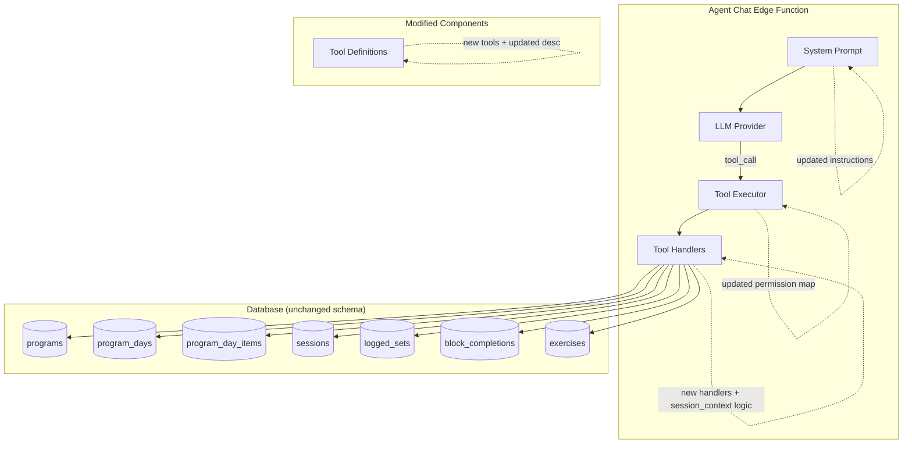
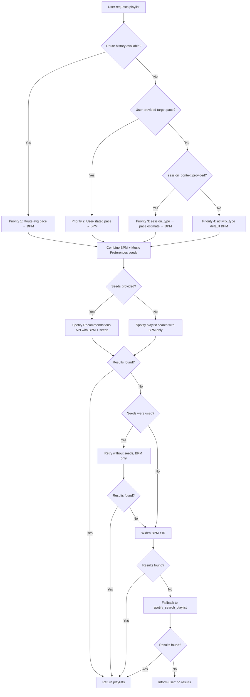

# Design Document: Optional Run History Playlist

## Overview

This feature decouples the `spotify_suggest_pace_playlist` tool from requiring route history data and introduces four new read-only retrieval tools (`get_active_program`, `get_session_history`, `get_session_details`, `get_programs`). Together these changes enable the Cadence agent to:

1. Suggest pace-matched playlists for users who have a training program but no GPS route data yet, using a new `session_context` parameter that maps session types to target pace estimates.
2. Proactively retrieve the user's program structure, session history, and logged set data so recommendations are grounded in actual training history rather than asking the user to describe it.
3. Accept optional music preference seeds (`genres`, `seed_artists`, `seed_tracks`) that personalize playlist recommendations via the Spotify Recommendations API, working alongside the BPM fallback hierarchy at every level.

The changes are entirely server-side within the Supabase Edge Function layer. No mobile app UI changes are required — the agent simply gains richer context and more flexible playlist behavior.

### Design Decisions & Rationale

| Decision | Rationale |
|----------|-----------|
| Add `session_context` as an optional param rather than making it a separate tool | Keeps the API surface small; the existing tool already handles BPM determination logic |
| Use a deterministic session_type → pace mapping in the handler | Avoids needing ML or complex inference; mapping is derived from well-established running coaching pace zones |
| Map new retrieval tools into existing permission categories | Reuses the permission infrastructure without schema changes; read-only tools still require permission gating for privacy |
| Keep BPM widening logic in the agent (system prompt) rather than the tool | The tool is a pure search tool; retry/fallback strategy is conversational behavior better expressed in the system prompt |
| Add music seed params to existing tool rather than a new "recommendations" tool | Seeds refine the same BPM-based playlist flow; a separate tool would split the fallback hierarchy logic across two places |
| Resolve artist/track names to IDs inside the handler | The agent provides human-readable names from conversation; resolving in the handler avoids exposing Spotify ID lookup as a separate tool and keeps the agent's job simpler |
| Retry without seeds on zero results before BPM-widening | Seeds can over-constrain the Recommendations API; removing them is the cheapest relaxation step before expanding BPM range |
| Cap combined seeds at 5 (Spotify API constraint) | The Spotify Recommendations API rejects requests with >5 total seeds; enforcing this early gives a clear error message |

## Architecture

The feature modifies the existing Supabase Edge Function architecture without introducing new services or infrastructure.



### Fallback Hierarchy (BPM Determination + Music Preferences)



**Key insight:** Music preference seeds are orthogonal to the BPM fallback hierarchy. Seeds refine *which tracks* are returned within the BPM range but never alter *what BPM range* is used. When seeds over-constrain results, the tool retries without them before falling through to BPM-widening.

## Components and Interfaces

### 1. Updated System Prompt (`agent-chat/index.ts`)

The system prompt is updated to:
- Remove the requirement for route history before suggesting playlists
- Instruct the agent to use `get_active_program` before making recommendations
- Define the fallback hierarchy for BPM determination
- Instruct the agent to use retrieval tools proactively

**Updated prompt excerpt:**
```
- When a user requests music for a running, cycling, or walking session, use the spotify_suggest_pace_playlist tool. This tool works with or without route history:
  1. If route history is available (via get_route_history), pass pace data as recent_route_summary for best BPM accuracy.
  2. If no route history exists but the user has an active program, pass session_context with the session type and planned duration.
  3. If neither is available, the tool will use activity-type defaults.
  When using fallback options 2, 3, or 4 (no route data), include a brief note that recommendations will improve as more routes are tracked.
- Before suggesting program modifications, exercises, or playlists, call get_active_program to understand the user's current training structure.
- When the user asks about progress, trends, or consistency, call get_session_history.
- When the user references a specific past workout, call get_session_details with the session ID.
- When the user asks about past programs or comparisons, call get_programs.
- Do not ask the user to describe their program, exercises, or sessions when that data is retrievable via tools.
- Music preferences: When a user requests a playlist and has not mentioned music preferences in the conversation, ask what genres, artists, or songs they enjoy for their workout. If the user mentions genres (e.g., "electronic", "hip-hop"), artist names (e.g., "The Weeknd", "Daft Punk"), or song titles (e.g., "Blinding Lights") anywhere in the conversation, extract those as music preferences and pass them as the `genres`, `seed_artists`, and `seed_tracks` parameters to spotify_suggest_pace_playlist. Music preferences are optional refinements — if the user declines to state preferences or does not answer, proceed with the playlist suggestion using BPM alone.
- When extracting music preferences from conversation, apply at most 5 total seeds (combined genres + artists + tracks). If the user mentions more than 5 preferences, select the 5 most recently mentioned and inform the user that Spotify allows a maximum of 5 seed values at a time.
- If the user contradicts a previous preference (e.g., "actually, not hip-hop, make it rock"), use the most recent preference and discard the contradicted one.
```

### 2. Updated Tool Definition: `spotify_suggest_pace_playlist`

**Changes:**
- Description updated to state route history is optional and music preferences can refine results
- New `session_context` parameter added
- New `genres`, `seed_artists`, `seed_tracks` parameters added

```typescript
{
  name: 'spotify_suggest_pace_playlist',
  description: 'Suggest a Spotify playlist tailored to the user\'s running/cycling/walking pace. Works with or without route history — activity_type is the only required parameter. When route history is available, uses pace data for precise BPM matching. When unavailable, accepts session_context (session type, planned duration, intensity) from the user\'s program to estimate appropriate BPM. Falls back to activity-type defaults when no context is provided. Optionally accepts genres, seed_artists, and seed_tracks to personalize recommendations via the Spotify Recommendations API (max 5 combined seeds).',
  parameters: {
    type: 'object',
    properties: {
      activity_type: { type: 'string', enum: ['running', 'cycling', 'walking'] },
      target_pace_seconds_per_km: { type: 'number' },
      duration_minutes: { type: 'number' },
      recent_route_summary: { /* existing schema */ },
      session_context: {
        type: 'object',
        description: 'Program-derived session context for BPM estimation when route history is unavailable.',
        properties: {
          session_type: {
            type: 'string',
            enum: ['easy run', 'tempo run', 'interval session', 'long run'],
          },
          planned_duration_minutes: { type: 'number', minimum: 1, maximum: 480 },
          intensity_label: { type: 'string', enum: ['low', 'moderate', 'high'] },
        },
      },
      genres: {
        type: 'array',
        items: { type: 'string' },
        description: 'Spotify genre identifiers for recommendations (e.g., "pop", "hip-hop", "electronic"). Combined with seed_artists and seed_tracks, max 5 total seeds.',
      },
      seed_artists: {
        type: 'array',
        items: { type: 'string' },
        description: 'Spotify artist IDs or artist names to seed recommendations. Names are resolved to IDs via the Spotify Search API. Combined with genres and seed_tracks, max 5 total seeds.',
      },
      seed_tracks: {
        type: 'array',
        items: { type: 'string' },
        description: 'Spotify track IDs or track names to seed recommendations. Names are resolved to IDs via the Spotify Search API. Combined with genres and seed_artists, max 5 total seeds.',
      },
    },
    required: ['activity_type'],
  },
}
```

### 3. New Tool: `get_active_program`

**Category:** `program_edits`

```typescript
{
  name: 'get_active_program',
  description: 'Retrieve the user\'s currently active training program with full structure (days, exercises, blocks, targets). Returns null if no active program exists.',
  parameters: { type: 'object', properties: {} },
}
```

**Handler behavior:**
- Query `programs` where `user_id = userId` and `status = 'active'`
- Join `program_days` → `program_day_items` → `exercises` (for name resolution)
- Join `program_day_items` → `blocks` (for block details)
- Return full nested structure or `{ active_program: null }`

### 4. New Tool: `get_session_history`

**Category:** `health_access`

```typescript
{
  name: 'get_session_history',
  description: 'Retrieve the user\'s recent completed workout sessions with summary data (date, program day, duration, sets, volume, PRs).',
  parameters: {
    type: 'object',
    properties: {
      limit: { type: 'integer', minimum: 1, maximum: 100, default: 10 },
      program_id: { type: 'string', description: 'Filter by program UUID' },
    },
  },
}
```

**Handler behavior:**
- Query `sessions` where `user_id = userId`, `status = 'completed'`, ordered by `completed_at DESC`
- Optionally filter by `program_id` (via `program_day_id` → `program_days.program_id`)
- For each session, compute aggregates: total sets, total volume (sum of `weight * reps`), PR count
- Return empty list for no results (never throw)

### 5. New Tool: `get_session_details`

**Category:** `health_access`

```typescript
{
  name: 'get_session_details',
  description: 'Retrieve all logged sets for a specific session, grouped by exercise, with session metadata and block completions.',
  parameters: {
    type: 'object',
    properties: {
      session_id: { type: 'string', description: 'UUID of the session' },
    },
    required: ['session_id'],
  },
}
```

**Handler behavior:**
- Verify session belongs to authenticated user
- Fetch `logged_sets` joined with `exercises.name`, ordered by exercise then set_number
- Fetch `block_completions` joined with `blocks.name`
- Return grouped structure with session metadata

### 6. New Tool: `get_programs`

**Category:** `program_edits`

```typescript
{
  name: 'get_programs',
  description: 'List all of the user\'s programs (active, draft, archived) with summary info.',
  parameters: {
    type: 'object',
    properties: {
      status: {
        type: 'string',
        enum: ['active', 'draft', 'archived', 'all'],
        default: 'all',
      },
    },
  },
}
```

**Handler behavior:**
- Query `programs` where `user_id = userId`, optional status filter
- For each program, count `program_days` and count completed `sessions`
- Return ordered by `updated_at DESC`

### 7. Updated `TOOL_PERMISSION_MAP` (tool-executor.ts)

```typescript
const TOOL_PERMISSION_MAP: Record<string, PermissionCategory> = {
  // ... existing entries ...
  get_active_program: 'program_edits',
  get_programs: 'program_edits',
  get_session_history: 'health_access',
  get_session_details: 'health_access',
};
```

### 8. Updated `determineBpmRange` Logic (tool-handlers.ts)

The existing function remains unchanged. A new helper `deriveSessionPace` converts `session_context` to a pace estimate:

```typescript
function deriveSessionPace(sessionContext: SessionContext): number {
  const basePaceMap: Record<string, number> = {
    'easy run': 390,
    'tempo run': 310,
    'interval session': 280,
    'long run': 360,
  };

  let pace = basePaceMap[sessionContext.session_type];
  if (!pace) {
    throw new Error(`Unrecognized session_type: "${sessionContext.session_type}". Valid: easy run, tempo run, interval session, long run`);
  }

  // Adjust by intensity
  switch (sessionContext.intensity_label) {
    case 'low': pace += 30; break;
    case 'high': pace -= 20; break;
    // 'moderate' = no adjustment
  }

  return pace;
}
```

The `spotify_suggest_pace_playlist` handler's pace resolution becomes:

```
effectivePace = targetPace
  ?? recentRouteSummary?.avg_pace_seconds_per_km
  ?? (sessionContext ? deriveSessionPace(sessionContext) : null)
```

### 9. Seed Validation Logic (tool-handlers.ts)

Before passing seeds to the Spotify Recommendations API, the handler validates the combined count and resolves names to IDs.

```typescript
interface MusicSeeds {
  genres: string[];
  seed_artists: string[];  // Spotify artist IDs (after resolution)
  seed_tracks: string[];   // Spotify track IDs (after resolution)
}

/**
 * Validates the combined seed count (max 5 per Spotify API constraint).
 * Throws a descriptive error if exceeded.
 */
function validateSeedCount(
  genres: string[] = [],
  seedArtists: string[] = [],
  seedTracks: string[] = []
): void {
  const total = genres.length + seedArtists.length + seedTracks.length;
  if (total > 5) {
    throw new Error(
      `Combined seed count exceeds maximum of 5. ` +
      `Provided: ${genres.length} genres, ${seedArtists.length} artists, ${seedTracks.length} tracks (total: ${total}).`
    );
  }
}
```

### 10. Name Resolution Logic (tool-handlers.ts)

Artist names and track names provided by the agent are resolved to Spotify IDs via the Spotify Search API before being passed to the Recommendations endpoint.

```typescript
/**
 * Resolves a value to a Spotify artist ID.
 * If the value looks like a Spotify ID (22-char alphanumeric), returns it as-is.
 * Otherwise, searches Spotify for the artist name and returns the top result's ID.
 */
async function resolveArtistId(
  value: string,
  accessToken: string
): Promise<string | null> {
  // Spotify IDs are 22-char base-62 strings
  if (/^[a-zA-Z0-9]{22}$/.test(value)) {
    return value;
  }
  
  const response = await spotifyApiRequest(
    `/search?q=${encodeURIComponent(value)}&type=artist&limit=1`,
    accessToken
  );
  
  return response.artists?.items?.[0]?.id ?? null;
}

/**
 * Resolves a value to a Spotify track ID.
 * If the value looks like a Spotify ID (22-char alphanumeric), returns it as-is.
 * Otherwise, searches Spotify for the track name and returns the top result's ID.
 */
async function resolveTrackId(
  value: string,
  accessToken: string
): Promise<string | null> {
  if (/^[a-zA-Z0-9]{22}$/.test(value)) {
    return value;
  }
  
  const response = await spotifyApiRequest(
    `/search?q=${encodeURIComponent(value)}&type=track&limit=1`,
    accessToken
  );
  
  return response.tracks?.items?.[0]?.id ?? null;
}

/**
 * Resolves all seed values, filtering out any that fail to resolve.
 * Returns the resolved MusicSeeds ready for the Recommendations API.
 */
async function resolveSeeds(
  genres: string[] = [],
  seedArtists: string[] = [],
  seedTracks: string[] = [],
  accessToken: string
): Promise<MusicSeeds> {
  const resolvedArtists = (
    await Promise.all(seedArtists.map((a) => resolveArtistId(a, accessToken)))
  ).filter((id): id is string => id !== null);

  const resolvedTracks = (
    await Promise.all(seedTracks.map((t) => resolveTrackId(t, accessToken)))
  ).filter((id): id is string => id !== null);

  return {
    genres,  // Genres are string identifiers, no resolution needed
    seed_artists: resolvedArtists,
    seed_tracks: resolvedTracks,
  };
}
```

### 11. Updated Handler Flow: `spotify_suggest_pace_playlist`

The handler now integrates seed validation, resolution, and the retry-without-seeds fallback:

```typescript
async function handleSuggestPacePlaylist(params: SuggestPacePlaylistParams, accessToken: string) {
  // 1. Validate seed count (throws if > 5)
  validateSeedCount(params.genres, params.seed_artists, params.seed_tracks);

  // 2. Determine BPM range (unchanged logic)
  const effectivePace = params.target_pace_seconds_per_km
    ?? params.recent_route_summary?.avg_pace_seconds_per_km
    ?? (params.session_context ? deriveSessionPace(params.session_context) : null);
  
  const bpmRange = determineBpmRange(params.activity_type, effectivePace);

  // 3. Check if seeds are provided
  const hasSeeds = (params.genres?.length ?? 0) + (params.seed_artists?.length ?? 0) + (params.seed_tracks?.length ?? 0) > 0;

  if (hasSeeds) {
    // 4a. Resolve names → IDs
    const resolvedSeeds = await resolveSeeds(
      params.genres, params.seed_artists, params.seed_tracks, accessToken
    );

    // 5a. Call Spotify Recommendations API with BPM + seeds
    const results = await spotifyRecommendations({
      seed_genres: resolvedSeeds.genres,
      seed_artists: resolvedSeeds.seed_artists,
      seed_tracks: resolvedSeeds.seed_tracks,
      target_tempo: (bpmRange.min + bpmRange.max) / 2,
      min_tempo: bpmRange.min,
      max_tempo: bpmRange.max,
    }, accessToken);

    if (results.tracks.length > 0) {
      return { tracks: results.tracks, bpm_range: bpmRange, source: 'recommendations_with_seeds' };
    }

    // 6a. Retry without seeds (Req 15.4)
    const retryResults = await spotifyRecommendations({
      target_tempo: (bpmRange.min + bpmRange.max) / 2,
      min_tempo: bpmRange.min,
      max_tempo: bpmRange.max,
    }, accessToken);

    if (retryResults.tracks.length > 0) {
      return { tracks: retryResults.tracks, bpm_range: bpmRange, source: 'recommendations_without_seeds' };
    }
  } else {
    // 4b. No seeds — use existing playlist search logic with BPM range
    const results = await searchPlaylistsByBpm(params.activity_type, bpmRange, accessToken);
    if (results.length > 0) {
      return { playlists: results, bpm_range: bpmRange, source: 'playlist_search' };
    }
  }

  // 7. Existing fallback: widen BPM ±10, then generic search (unchanged)
  // ... (existing fallback logic continues here)
}
```

## Data Models

### Session Context (new input type)

```typescript
interface SessionContext {
  session_type: 'easy run' | 'tempo run' | 'interval session' | 'long run';
  planned_duration_minutes?: number; // 1-480
  intensity_label?: 'low' | 'moderate' | 'high';
}
```

### Music Seeds (new input type)

```typescript
interface MusicSeedsInput {
  genres?: string[];       // Valid Spotify genre identifiers (e.g., "pop", "electronic")
  seed_artists?: string[]; // Spotify artist IDs or artist names (resolved to IDs by handler)
  seed_tracks?: string[];  // Spotify track IDs or track names (resolved to IDs by handler)
}

interface ResolvedMusicSeeds {
  genres: string[];        // Passed through as-is
  seed_artists: string[];  // Resolved to Spotify artist IDs
  seed_tracks: string[];   // Resolved to Spotify track IDs
}
```

**Constraint:** `genres.length + seed_artists.length + seed_tracks.length <= 5` (Spotify Recommendations API limit)

### Session Type → Pace Mapping (constant)

| session_type | Base Pace (s/km) | + low (+30) | moderate (±0) | + high (-20) |
|---|---|---|---|---|
| easy run | 390 | 420 | 390 | 370 |
| tempo run | 310 | 340 | 310 | 290 |
| interval session | 280 | 310 | 280 | 260 |
| long run | 360 | 390 | 360 | 340 |

### get_active_program Response Shape

```typescript
interface ActiveProgramResponse {
  active_program: {
    id: string;
    name: string;
    status: 'active';
    created_at: string;
    updated_at: string;
    days: Array<{
      id: string;
      day_number: number;
      name: string;
      items: Array<{
        type: 'exercise' | 'block';
        order: number;
        exercise_name: string | null;    // resolved from exercises table
        block_name: string | null;       // from blocks table
        block_type: string | null;       // circuit, superset, amrap, custom
        block_timer_config: object | null;
        target_sets: number;
        target_reps: string;
        target_weight: number | null;
        target_rpe: number | null;
        timer_config: object | null;
        notes: string | null;
      }>;
    }>;
  } | null;
}
```

### get_session_history Response Shape

```typescript
interface SessionHistoryResponse {
  sessions: Array<{
    id: string;
    program_day_name: string;
    completed_at: string;
    total_duration_seconds: number;
    total_sets: number;
    total_volume_kg: number;
    pr_count: number;
  }>;
}
```

### get_session_details Response Shape

```typescript
interface SessionDetailsResponse {
  session: {
    id: string;
    program_day_name: string;
    status: string;
    started_at: string;
    completed_at: string | null;
    total_duration_seconds: number | null;
  };
  exercises: Array<{
    exercise_name: string;
    sets: Array<{
      set_number: number;
      reps: number;
      weight: number;
      rpe: number | null;
      is_pr: boolean;
      pr_type: string | null;
      actual_duration_seconds: number | null;
    }>;
  }>;
  block_completions: Array<{
    block_name: string;
    actual_duration_seconds: number;
    actual_rounds: number;
  }>;
}
```

### get_programs Response Shape

```typescript
interface ProgramsListResponse {
  programs: Array<{
    id: string;
    name: string;
    status: 'active' | 'draft' | 'archived';
    created_at: string;
    updated_at: string;
    days_count: number;
    sessions_count: number;
  }>;
}
```


## Correctness Properties

*A property is a characteristic or behavior that should hold true across all valid executions of a system — essentially, a formal statement about what the system should do. Properties serve as the bridge between human-readable specifications and machine-verifiable correctness guarantees.*

### Property 1: Session type to pace mapping is correct

*For any* valid `session_type` in ["easy run", "tempo run", "interval session", "long run"] and any valid `intensity_label` in ["low", "moderate", "high"], `deriveSessionPace({ session_type, intensity_label })` SHALL return `basePaceMap[session_type] + intensityAdjustment[intensity_label]` where basePaceMap is {"easy run": 390, "tempo run": 310, "interval session": 280, "long run": 360} and intensityAdjustment is {"low": +30, "moderate": 0, "high": -20}.

**Validates: Requirements 3.2, 5.3**

### Property 2: Activity-type default BPM ranges

*For any* `activity_type` in ["running", "cycling", "walking"] with a null pace, `determineBpmRange(activity_type, null)` SHALL return the documented default BPM range: running → {min: 160, max: 175}, walking → {min: 115, max: 135}, cycling → {min: 130, max: 160}.

**Validates: Requirements 3.3**

### Property 3: Fallback priority hierarchy for effective pace

*For any* combination of inputs `(targetPace, recentRouteSummary, sessionContext)` where at least one is provided, the handler's `effective_pace_seconds_per_km` SHALL equal the value from the highest-priority source present: (1) `targetPace` if non-null, else (2) `recentRouteSummary.avg_pace_seconds_per_km` if provided, else (3) `deriveSessionPace(sessionContext)` if session_context is provided, else (4) null (triggering activity-type default).

**Validates: Requirements 4.1, 5.2**

### Property 4: Invalid session_type produces descriptive error

*For any* string value that is NOT one of ["easy run", "tempo run", "interval session", "long run"], calling `deriveSessionPace` with that value as `session_type` SHALL throw an error whose message contains the unrecognized value and lists the valid options.

**Validates: Requirements 5.4**

### Property 5: Session history returns only owned completed sessions in descending order

*For any* result returned by `get_session_history`, every session in the list SHALL have `user_id` equal to the authenticated user's ID and `status` equal to 'completed', and the list SHALL be ordered by `completed_at` in strictly non-increasing (descending) order.

**Validates: Requirements 7.4**

### Property 6: Programs list is ordered by updated_at descending

*For any* result returned by `get_programs`, the list of programs SHALL be ordered by `updated_at` in strictly non-increasing (descending) order.

**Validates: Requirements 9.3**

### Property 7: Invalid status filter produces descriptive error

*For any* string value that is NOT one of ["active", "draft", "archived", "all"], calling `get_programs` with that value as `status` SHALL return an error response whose message contains the unrecognized value and lists the valid options.

**Validates: Requirements 9.7**

### Property 8: Session history limit parameter validation

*For any* integer value outside the range [1, 100], calling `get_session_history` with that value as `limit` SHALL return an error response indicating the valid range. *For any* integer in [1, 100], the handler SHALL return at most that many sessions without error.

**Validates: Requirements 7.2**

### Property 9: Combined seed count validation

*For any* combination of `genres`, `seed_artists`, and `seed_tracks` arrays, if the combined total count is less than or equal to 5, `validateSeedCount` SHALL not throw and the handler SHALL proceed. If the combined total exceeds 5, `validateSeedCount` SHALL throw an error whose message contains the counts for each category and the total.

**Validates: Requirements 11.4, 11.5**

### Property 10: Seeds coexist with BPM range at all fallback levels

*For any* valid set of music seeds (combined total ≤ 5) and *for any* BPM determination source (route history pace, explicit target pace, session_context-derived pace, or activity-type default), the Spotify Recommendations API call SHALL include both the BPM range attributes (`min_tempo`, `max_tempo`, `target_tempo`) and the seed parameters (`seed_genres`, `seed_artists`, `seed_tracks`).

**Validates: Requirements 11.6, 14.1, 14.2, 14.3, 14.4**

### Property 11: Music preferences do not alter BPM range

*For any* set of tool inputs (activity_type, target_pace, session_context, recent_route_summary), the computed `bpmRange` SHALL be identical whether or not `genres`, `seed_artists`, and `seed_tracks` are provided. The BPM determination logic is independent of music seed parameters.

**Validates: Requirements 14.5**

### Property 12: Empty or absent seeds produce no seed parameters in API request

*For any* invocation where `genres`, `seed_artists`, and `seed_tracks` are all absent, undefined, or empty arrays, the handler SHALL NOT include `seed_genres`, `seed_artists`, or `seed_tracks` parameters in the Spotify API call, and SHALL use the existing playlist search logic based on BPM range alone.

**Validates: Requirements 15.1, 15.2, 15.3**

## Error Handling

### Tool-Level Errors

| Scenario | Behavior |
|----------|----------|
| `deriveSessionPace` receives invalid `session_type` | Throws error listing valid options; handler catches and returns structured error to agent |
| `validateSeedCount` receives > 5 combined seeds | Throws error with counts per category and total; handler catches and returns structured error to agent |
| `resolveArtistId` fails to find artist by name | Returns null; filtered out of resolved list (silent degradation) |
| `resolveTrackId` fails to find track by name | Returns null; filtered out of resolved list (silent degradation) |
| Spotify Recommendations API returns zero results with seeds | Handler retries without seeds before falling through to BPM-widening |
| `get_active_program` DB query fails | Throws error with descriptive message (e.g., "Failed to fetch active program: {db_error}") |
| `get_session_details` with non-existent/unauthorized session_id | Returns error "Session not found" (no information leakage about existence) |
| `get_session_history` with invalid `limit` | Returns error "limit must be between 1 and 100" |
| `get_programs` with invalid `status` | Returns error listing valid status values |
| `get_session_history` with unauthorized `program_id` | Returns empty list (no error, no existence leakage) |
| Spotify API failure in `spotify_suggest_pace_playlist` | Existing error propagation via `spotifyApiRequest` — unchanged |

### System Prompt-Driven Fallbacks

These are not code errors but conversational recovery paths instructed by the system prompt:

1. **Zero Spotify results with seeds** → Handler retries without seeds (code-level, Req 15.4)
2. **Zero Spotify results without seeds** → Agent widens BPM by ±10 and retries
3. **Zero results after widening** → Agent falls back to `spotify_search_playlist` with activity keyword
4. **All searches empty** → Agent informs user and suggests manual search
5. **Retrieval tool returns empty** → Agent proceeds with conversational context and informs user no stored data found

### Permission Gating

All new tools pass through the existing `executeToolCall` framework:
- If user permission is `approval_required`, tool returns `pending_approval` without executing
- If user permission is `auto_apply`, tool executes and result is returned
- All calls (success or failure) are logged to `audit_log`

## Testing Strategy

### Property-Based Tests (fast-check)

This feature's pure logic functions are well-suited for property-based testing. We'll use [fast-check](https://github.com/dubzzz/fast-check) for TypeScript PBT.

**Configuration:**
- Minimum 100 iterations per property test
- Each test tagged with: `Feature: optional-run-history-playlist, Property {N}: {title}`

**Properties to implement:**
1. `deriveSessionPace` correctness (Property 1)
2. `determineBpmRange` defaults (Property 2)
3. Fallback priority logic (Property 3)
4. Invalid session_type error (Property 4)
5. Session history ordering invariant (Property 5)
6. Programs ordering invariant (Property 6)
7. Invalid status error (Property 7)
8. Limit validation (Property 8)
9. Combined seed count validation (Property 9)
10. Seeds coexist with BPM at all fallback levels (Property 10)
11. Seeds do not alter BPM range (Property 11)
12. Empty/absent seeds produce no seed params (Property 12)

### Unit Tests (example-based)

| Test | Validates |
|------|-----------|
| System prompt contains instruction to use playlist tool without route condition | Req 1.1–1.4, 10.1–10.6 |
| System prompt contains music preference detection instructions | Req 12.1–12.4 |
| Tool description states route history is optional | Req 2.1–2.4 |
| Tool definition includes `session_context` parameter with correct schema | Req 5.1 |
| Tool definition includes `genres`, `seed_artists`, `seed_tracks` as optional array params | Req 11.1–11.3, 15.2 |
| `get_active_program` returns null for user with no active program | Req 6.2 |
| `get_active_program` resolves exercise names | Req 6.3 |
| `get_active_program` includes blocks with name/type/timer_config | Req 6.7 |
| `get_session_details` returns error for non-existent session | Req 8.6 |
| Permission map includes all 4 new tools in correct categories | Req 6.4, 7.5, 8.5, 9.4 |
| `resolveArtistId` passes through valid 22-char IDs without API call | Req 11.2 |
| `resolveArtistId` searches Spotify for non-ID strings | Req 11.2 |
| `resolveTrackId` passes through valid 22-char IDs without API call | Req 11.3 |
| `resolveTrackId` searches Spotify for non-ID strings | Req 11.3 |
| Handler retries without seeds when Recommendations API returns 0 results with seeds | Req 15.4 |
| Handler with no seeds skips Recommendations API entirely, uses playlist search | Req 15.1, 15.3 |

### Integration Tests

| Test | Validates |
|------|-----------|
| `get_active_program` returns full nested structure for a seeded program | Req 6.1, 6.5 |
| `get_session_history` returns correct aggregates (sets, volume, PRs) | Req 7.1 |
| `get_session_history` filters by program_id correctly | Req 7.3 |
| `get_session_details` returns grouped sets and block completions | Req 8.1, 8.3, 8.7 |
| `get_programs` includes days_count and sessions_count | Req 9.5 |
| `spotify_suggest_pace_playlist` with session_context returns correct BPM range | Req 5.2 |
| `spotify_suggest_pace_playlist` with genres + session_context calls Recommendations API with both seeds and BPM | Req 14.2, 11.6 |
| `spotify_suggest_pace_playlist` with artist names resolves to IDs and returns tracks | Req 11.2, 11.6 |
| End-to-end: seeds provided → zero results → retry without seeds succeeds | Req 15.4 |

### Test Infrastructure

- **Test runner:** Deno test (matching the Supabase Edge Function runtime)
- **PBT library:** fast-check (available via esm.sh for Deno)
- **Mocking:** Supabase client mocked for unit/property tests; real local Supabase for integration tests
- **Property test tag format:** `// Feature: optional-run-history-playlist, Property {N}: {title}`
