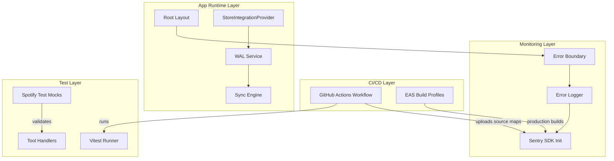

# Design Document: Stabilization & Hardening

## Overview

This design covers a stabilization pass across five areas of the Cadence fitness app. The work focuses on fixing broken test infrastructure, adding CI automation, integrating production error monitoring, fixing a missing import, and configuring EAS builds. No user-facing functionality changes — this is purely developer-experience and reliability infrastructure.

The design is organized by requirement area, with each section describing the technical approach, file changes, and rationale.

## Architecture

The changes span four architectural layers:



**Key principle**: Each change is isolated. The test mock fixes don't affect runtime code. Sentry integration is conditional (DSN-gated). The WAL import fix corrects an existing reference. EAS config is a new declarative file.

## Components and Interfaces

### 1. Spotify Test Mock Corrections

**Files modified**: `tests/unit/spotify-tool-handlers.test.ts`

**Problem analysis**: The current test file has mock mismatches with the actual handler implementation in `supabase/functions/_shared/tool-handlers.ts`:

| Test Area | Current Mock | Actual Implementation | Fix |
|-----------|-------------|----------------------|-----|
| `spotify_create_playlist` create endpoint | `POST /users/{id}/playlists` only | Multi-endpoint retry: `/me/playlists` first, then `/users/{id}/playlists` fallback | Mock both endpoints in order; primary succeeds → no fallback call |
| `spotify_create_playlist` Supabase query | Not mocked | Handler queries `user_spotify_tokens` for debug logging | Add Supabase mock returning token record |
| `spotify_suggest_pace_playlist` search URL | Arbitrary mock match | Handler constructs query via `buildPacePlaylistQuery()` → `"{label} {min}-{max} bpm {activityType}"` for running | Match exact query string format |
| `spotify_modify_playlist` remove endpoint/body | `DELETE /playlists/{id}/tracks` with `{ tracks: [{uri}] }` | `DELETE /playlists/{id}/items` with `{ uris: [...] }` | Update endpoint path and body format |

**Design decisions**:
- The `spotify_create_playlist` tests need to account for the ordered endpoint retry loop. Tests verifying primary success should assert the fallback endpoint is NOT called. Tests verifying fallback should mock primary as throwing, then fallback as succeeding.
- The `mockSupabase` object needs a `.from().select().eq().single()` chain mock for the `user_spotify_tokens` table query used for debug logging.
- For `spotify_suggest_pace_playlist`, the mock URL assertion needs to match the exact encoded output of `buildPacePlaylistQuery(activityType, bpmRange, durationMinutes)`.

**Interface changes**: None — only test file internals change.

### 2. GitHub Actions CI Pipeline

**Files created**: `.github/workflows/ci.yml`

**Workflow design**:

```yaml
name: CI
on:
  push:
    branches: [main]
  pull_request:

jobs:
  validate:
    runs-on: ubuntu-latest
    steps:
      - Checkout
      - Setup Node.js 20
      - Cache node_modules (npm cache)
      - npm ci
      - npx tsc --noEmit
      - npx vitest --run
      - npx expo lint
```

**Design decisions**:
- Single job with sequential steps (type-check → test → lint). If any step fails, subsequent steps are skipped via GitHub Actions' default `if: success()` behavior.
- Node.js 20 pinned via `actions/setup-node@v4` with `node-version: '20'`.
- npm cache via `actions/setup-node`'s built-in `cache: 'npm'` option — simpler than manual `actions/cache`.
- Trigger on push to `main` and on all pull requests (any target branch).
- `npx vitest --run` ensures single-pass execution (no watch mode).
- `npx expo lint` uses the project's configured lint setup.

### 3. Sentry Error Monitoring Integration

**Files created/modified**:
- `package.json` — add `@sentry/react-native` dependency
- `src/lib/sentry.ts` — new Sentry initialization module
- `src/lib/error-logger.ts` — extend to forward errors to Sentry in production
- `src/components/ErrorBoundary.tsx` — report to Sentry with component stack
- `src/app/_layout.tsx` — initialize Sentry at app start
- `.github/workflows/ci.yml` — add source map upload step for production builds

**Module: `src/lib/sentry.ts`**

```typescript
interface SentryConfig {
  dsn: string;
  environment: 'development' | 'preview' | 'production';
  release: string;
}

export function initSentry(): void;
export function captureException(error: Error, context?: Record<string, unknown>): void;
export function isSentryInitialized(): boolean;
```

**Initialization logic**:
1. Read DSN from `process.env.EXPO_PUBLIC_SENTRY_DSN` (Expo public env var pattern).
2. If DSN is missing/empty → skip initialization, set internal flag to `false`.
3. Determine environment from `__DEV__` flag and `Constants.expoConfig?.extra?.eas?.channel`:
   - `__DEV__` → `'development'`
   - Channel `'preview'` → `'preview'`
   - Otherwise → `'production'`
4. Only send events when environment is `'production'` or `'preview'` (not `'development'`).
5. Read app version from `Constants.expoConfig?.version`.

**Error Logger extension**:
- In production mode, after structured JSON logging, call `captureException()` with metadata (component stack, route, session ID).
- If Sentry is not initialized (no DSN), log to console only (existing behavior preserved).

**ErrorBoundary extension**:
- In `componentDidCatch`, after calling `logError()`, also call `Sentry.captureException(error, { contexts: { react: { componentStack } } })`.
- The component tree name is derived from the `componentStack` string (first component name).

**Source map upload**:
- During EAS production builds, use `@sentry/react-native`'s built-in Expo plugin or a separate `sentry-expo` upload step.
- CI pipeline adds a conditional step: if building production, upload source maps via `npx sentry-cli releases files upload-sourcemaps`.
- On upload failure, the build step fails (non-zero exit).

**Design decisions**:
- DSN-gated initialization means the app works identically without Sentry configured (safe for local dev, preview without DSN).
- Using `@sentry/react-native` instead of `sentry-expo` — Sentry recommends the direct SDK for SDK 50+ projects.
- Environment detection via EAS channel name aligns with the EAS update channels defined in Requirement 5.
- Source map upload integrated into CI rather than a post-build hook — ensures traceability and failure visibility.

### 4. Fix initWAL Import in StoreIntegrationProvider

**File modified**: `src/providers/StoreIntegrationProvider.tsx`

**Problem**: The file calls `initWAL()` on line ~172 but never imports it. The function exists in `@/services/wal` as a named export.

**Fix**: Add `import { initWAL } from '@/services/wal';` to the import block.

**Error handling**: Wrap `initWAL()` in a try/catch. On failure:
1. Log the error via the Error Logger.
2. Skip `initSyncEngine()` (the sync engine depends on WAL).
3. Continue rendering children — the app degrades to online-only mode without crashing.

**Current code** (relevant section in the sync engine effect):
```typescript
// Initialize WAL first (sync engine depends on it), then sync engine
initWAL();
initSyncEngine();
```

**Updated code**:
```typescript
import { initWAL } from '@/services/wal';
// ...
try {
  initWAL();
} catch (err) {
  logError(
    err instanceof Error ? err : new Error(String(err)),
    { componentStack: '' } as React.ErrorInfo,
    'StoreIntegrationProvider:initWAL'
  );
  return; // Skip sync engine init — degrade gracefully
}
initSyncEngine();
```

**Design decisions**:
- The import was clearly intended (the call exists) but was accidentally omitted or removed during a refactor.
- Graceful degradation on WAL failure preserves the user experience — data still syncs in real-time via Supabase Realtime, just without offline persistence.
- The `return` from the effect setup means cleanup functions are still registered properly (no dangling subscriptions).

### 5. EAS Build Configuration

**File created**: `eas.json` (project root)

**Structure**:

```json
{
  "cli": {
    "version": ">= 15.0.0"
  },
  "build": {
    "development": {
      "distribution": "internal",
      "developmentClient": true,
      "channel": "development",
      "ios": {},
      "android": {}
    },
    "preview": {
      "distribution": "internal",
      "developmentClient": false,
      "channel": "preview",
      "ios": {},
      "android": {}
    },
    "production": {
      "distribution": "store",
      "channel": "production",
      "autoIncrement": true,
      "ios": {
        "autoIncrement": true
      },
      "android": {
        "autoIncrement": true
      }
    }
  }
}
```

**Design decisions**:
- No `projectId` in `eas.json` — it's already declared at `app.json > expo.extra.eas.projectId` (`e8d584e8-d6f2-4a0c-ba8d-9ddeea27f2be`). EAS CLI reads it from there automatically.
- `channel` per profile enables EAS Update to target the correct environment (matches Sentry environment detection).
- `autoIncrement: true` on production for both platforms — EAS auto-increments `ios.buildNumber` and `android.versionCode` on each submission build.
- `development` profile uses `developmentClient: true` for Expo dev client loading.
- `preview` profile uses `developmentClient: false` + `distribution: internal` — produces a standalone build distributed via internal link (TestFlight-like without App Store review).
- Empty `ios: {}` and `android: {}` objects are included to satisfy the requirement that both platform configs exist, while inheriting defaults.

## Data Models

No new database tables or schema changes are introduced. The changes are purely infrastructure, configuration, and code-level fixes.

**Environment variables** (new):
| Variable | Purpose | Required |
|----------|---------|----------|
| `EXPO_PUBLIC_SENTRY_DSN` | Sentry project DSN for error reporting | Optional (Sentry disabled if absent) |
| `SENTRY_AUTH_TOKEN` | CI token for source map upload | Required in CI for production builds |
| `SENTRY_ORG` | Sentry organization slug | Required in CI for production builds |
| `SENTRY_PROJECT` | Sentry project slug | Required in CI for production builds |

## Error Handling

### Sentry Initialization Failure
- **Scenario**: Invalid DSN, network issues during SDK init, or SDK crash.
- **Behavior**: Sentry SDK init is wrapped in try/catch. On failure, `isSentryInitialized()` returns `false`. All subsequent `captureException` calls become no-ops. Console logging continues normally.
- **User impact**: None. Error monitoring silently degrades.

### WAL Initialization Failure
- **Scenario**: SQLite database corruption, file system permission error, or platform incompatibility.
- **Behavior**: Error caught in StoreIntegrationProvider, logged via Error Logger (and Sentry if available). Sync engine skipped. App continues with Supabase Realtime for data sync.
- **User impact**: Offline persistence unavailable for that session. Data still syncs when online.

### CI Pipeline Failures
- **Scenario**: Type errors, test failures, or lint violations.
- **Behavior**: GitHub Actions marks the workflow run as failed. PR cannot be merged (if branch protection enabled).
- **User impact**: None (developer workflow only).

### Source Map Upload Failure
- **Scenario**: Invalid auth token, network timeout, or Sentry API error.
- **Behavior**: CI build step fails with descriptive error. Build artifact is still produced but stack traces won't be symbolicated.
- **User impact**: Developers see obfuscated stack traces in Sentry until the issue is resolved and a new build is created.

## Testing Strategy

### Assessment: Property-Based Testing Applicability

Property-based testing is **NOT applicable** for this feature. The five requirements cover:

1. **Test mock corrections** — Configuration/wiring fixes in test files. No algorithmic logic with varying inputs.
2. **CI pipeline** — Declarative YAML configuration (IaC equivalent).
3. **Sentry integration** — Side-effect-only operations (sending errors to external service) and conditional initialization.
4. **Import fix** — A single missing import statement with error handling wrapper.
5. **EAS configuration** — Declarative JSON configuration.

None of these involve pure functions with meaningful input variation or universal properties. Example-based unit tests and integration tests are the appropriate testing strategy.

### Testing Approach by Requirement

**Requirement 1 — Spotify Test Mocks**:
- The fix IS the tests. Run `npx vitest --run tests/unit/spotify-tool-handlers.test.ts` and verify zero failures.
- No additional test files needed — the existing test file's passing state IS the acceptance criteria.

**Requirement 2 — CI Pipeline**:
- Validate YAML syntax locally with `actionlint` or similar.
- Integration test: push to a branch and verify the workflow triggers and passes.
- No unit tests — CI configuration is tested by running it.

**Requirement 3 — Sentry Integration**:
- Unit test `src/lib/sentry.ts`:
  - Test that `initSentry()` does NOT throw when DSN is missing.
  - Test that `captureException()` is a no-op when not initialized.
  - Test environment detection logic (mock `__DEV__` and `Constants`).
- Unit test `src/lib/error-logger.ts`:
  - Test that production mode calls `captureException`.
  - Test that development mode does NOT call `captureException`.
- Unit test `src/components/ErrorBoundary.tsx`:
  - Test that `componentDidCatch` calls Sentry capture.

**Requirement 4 — Fix initWAL Import**:
- Existing test at `tests/services/wal.test.ts` validates WAL functionality.
- Add a unit test for the StoreIntegrationProvider's error handling:
  - Mock `initWAL` to throw → verify `initSyncEngine` is NOT called.
  - Mock `initWAL` to succeed → verify `initSyncEngine` IS called.

**Requirement 5 — EAS Configuration**:
- Validate `eas.json` structure with `npx eas-cli config:validate` (if available) or JSON schema validation.
- Manual test: run `eas build --profile development --platform ios --dry-run` to verify profile resolution.
- No unit tests — declarative config is validated by the tooling that consumes it.
